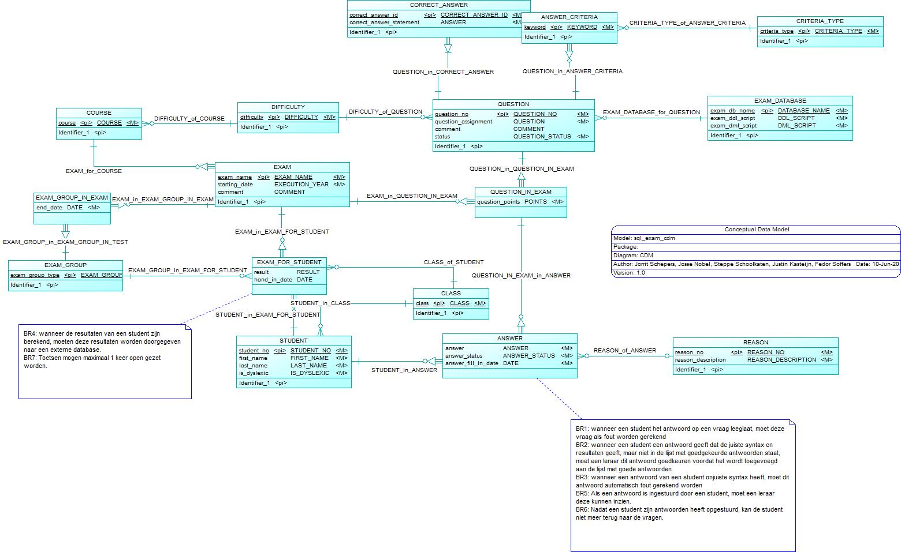

Functioneel ontwerp - ISE Projectgroep 4

Assingment: SQL Exam Database
-----------------------------

| Documentinformatie   |                                                                                      |
|----------------------|--------------------------------------------------------------------------------------|
| Datum van publicatie |                                                                                      |
| Organisatie          | Hogeschool van Arnhem en Nijmegen                                                    |
| Afdeling             | AIM                                                                                  |
| Projectgroep         | Groep 4                                                                              |
| Opleiding            | HBO-ICT                                                                              |
| Profiel              | Software Development, Data Solutions Development                                     |
| Semester             | ISE                                                                                  |
| Begeleiders          | dhr. M. Engelbart                                                                    |
|                      | dhr. L. Van Den Berge                                                                |
|                      | dhr M. De Jonge                                                                      |
|                      | mvr. E. Bouwman                                                                      |
|                      | dhr. C. Scholten                                                                     |

Inhoudsopgave
-------------

-   [Inleiding](#Inleiding)

-   [Business process model](#Business-process-model)

-   [Use case model](#Use-case-model)

-   [Requirements](#Requirements)

-   [Verbalisering van feiten](#Verbalisering-van-feiten)

-   [CRUD matrix](#CRUD-matrix)

-   [Business Rules](#Busines-rules)

-   [Conceptual data model](#Conceptual-data-model)

-   [Domains](#Domains)

-   [Genomen beslissingen](#Genomen-beslissingen)

-   [Constraints](#Constraints)

Inleiding
---------

In dit document zullen de functionele aspecten worden behandeld van de opdracht
SQL exam database. Dit document bevat de verbalisering van feiten, die opgehaald
zijn vanuit de gegeven opdracht. Deze feiten zijn opgesplits in entities. Daarnaast zijn er uit
deze feiten een aantal business rules geformuleerd. Aan de hand van deze analyse is een
Conceptual Data Model ontworpen. Dit model bevat de entities, subtypes, relaties en
domains die in het systeem gebruikt zullen gaan worden.

Dit document is ontworpen voor de opdracht SQL exam database. Deze opdracht is ontstaan vanuit een probleem op de Hogeschool Arnhem Nijmegen afdeling (HAN) AIM. De HAN geeft onder andere les over databases, waar de taal SQL centraal staat.
Het probleem met deze programmertaal is dat er door de jaren heen veel meer mogelijkheden zijn gekomen om informatiebehoeftes op te lossen. Door de hoeveelheid verschillende correcte antwoorden die studenten kunnen geven voor een vraag is het voor docenten veel meer werk om gemaakte tentamens na te kijken.

Het systeem dat in dit document beschreven staat moet ervoor gaan zorgen dat docenten minder tijd hoeven te gebruiken voor het nakijken van tentamens voor de database courses. Ook moet dit systeem de resultaten van die tentamens naar een externe database kunnen verplaatsen om rapportages te genereren.

In dit document zullen als eerste een aantal business proces models en use case models worden getoond om een duidelijk beeld te geven hoe de verschillende processen in dit systeem zullen gaan werken. Daarna worden alle verschillende feittypes die van toepassing zijn op dit systeem weergegeven en geanalyseerd zodat er een duidelijk overzicht gemaakt kan worden van alle entiteiten en domeinen die in het systeem zitten. Als laatste zullen alle integriteitsregels worden behandeld om aan te geven aan welke eisen het systeem moet gaan voldoen. Ook zullen hier een aantal keuzes uiteen worden gezet om te verhelderen waarom het systeem op deze manier ontworpen gaat worden.

Business process model
----------------------

In dit hoofdstuk worden de bedrijfsprocessen toegelicht om duidelijk te maken hoe de verschillende processen van het systeem met elkaar gaan werken. Er is gebruik gemaakt van BPMN-modellen om dit in kaart te brengen. Er zijn drie processen behandeld, namelijk:
* 	Nakijken van vragen: het mees essentiele onderdeel van het systeem dat ervoor moet zorgen dat docenten minder tijd hoeven te besteden aan het nakijken van tentamens 
*	Vragen beantwoorden: een belangrijk onderdeel dat het proces vanuit de studenten behandeld, die van dit systeem gebruik gaan maken om tentamens te maken 
*	Vragen toevoegen: een belangrijk onderdeel dat het proces vanuit de docenten behandeld, die van dit systeem gebruik gaan maken om tentamens toe te voegen
Het verloop van de processen zijn besproken met de opdrachtgever. 
 

> Fig 1 Vragen beantwoorden

> Fig 2 Vragen toevoegen

> Fig 3 Vragen nakijken

Use casemodel
-------------

In dit hoofdstuk worden het use case model en alle bijbehorende fully dressed use cases
weergegeven. Deze fully dressed use cases gaan meer in op de verschillende alternative flows die kunnen voorkomen in het systeem.

### Use case model

Use case model

\> Fig 4 Use case model

### Fully dressed use cases

Use Cases
=========

-   [Actoren](#actoren:)

-   [Requirements](#requirements)

-   [Use Cases](#use-cases)

    -   [Student](#student)

        -   [FR3. Student moet vragen kunnen
            beantwoorden.](#FR3.-Student-moet-vragen-kunnen-beantwoorden.)

    -   [Leraar](#leraar)

        -   [FR1. Een Leraar moet een set vragen met bijbehorende antwoorden
            kunnen
            uploaden.](#FR1.-Een-Leraar-moet-een-set-vragen-met-bijbehorende-antwoorden-kunnen-uploaden.)

        -   [FR2. Een Leraar moet een DDL en DML-script kunnen
            uploaden.](#FR2.-Een-Leraar-moet-een-DDL-en-DML-script-kunnen-uploaden.)

        -   [FR4. Een Leraar moet de antwoorden van de student kunnen
            inzien](#FR4.-Een-Leraar-moet-de-antwoorden-van-de-student-kunnen-inzien)

        -   [FR5. Alleen Leraren mogen van alle studenten de behaalde resultaten
            zien](#FR5.-Alleen-Leraren-mogen-van-alle-studenten-de-behaalde-resultaten-zien)

        -   [FR6. Een leraar moet een gegeven antwoord van een student kunnen
            toevoegen aan de lijst met correcte
            antwoorden](#FR6.-Een-leraar-moet-een-gegeven-antwoord-van-een-student-kunnen-toevoegen-aan-de-lijst-met-correcte-antwoorden)

-   [Use Case Diagram](#Use-Case-Diagram)

Actoren
-------

-   Student: studenten gaan dit systeem gebruiken om tentamens te maken en in te leveren.

-   Leraar: leraren gaan dit systeem gebruiken om tentamens op te zetten voor de studenten en om deze te laten nakijken door het systeem.

Requirements
------------

### Student

~~~~~~~~~~~~~~~~~~~~~~~~~~~~~~~~~~~~~~~~~~~~~~~~~~~~~~~~~~~~~~~~~~~~~~~~~~~~~~~~
- FR3: een student moet een gegeven set vragen kunnen beantwoorden
~~~~~~~~~~~~~~~~~~~~~~~~~~~~~~~~~~~~~~~~~~~~~~~~~~~~~~~~~~~~~~~~~~~~~~~~~~~~~~~~

### Leraar

~~~~~~~~~~~~~~~~~~~~~~~~~~~~~~~~~~~~~~~~~~~~~~~~~~~~~~~~~~~~~~~~~~~~~~~~~~~~~~~~
- FR1: een leraar moet een set vragen en bijbehorende antwoorden kunnen uploaden
- FR2: een leraar moet een DDL en DML-script kunnen uploaden
- FR4: een leraar moet de antwoorden van de student kunnen inzien
- FR5: alleen leraren mogen van alle studenten de behaalde resultaten zien
- FR6: een leraar moet een gegeven antwoord van een student kunnen toevoegen aan de lijst met correcte antwoorden
~~~~~~~~~~~~~~~~~~~~~~~~~~~~~~~~~~~~~~~~~~~~~~~~~~~~~~~~~~~~~~~~~~~~~~~~~~~~~~~~

Fully Dressed Use Cases
---------

#### Student moet kunnen inloggen.
| USE CASE: | Inloggen |
|-----------|-------------------------|
| ID		| US-1		|
| Title		| Een gebruiker kan inloggen | 
| Description | Er zijn verschillende rechten die nodig zijn om het informatiesysteem te laten functioneren. Hierbij moet het mogelijk zijn om te detecteren wie welke rechten heeft. Dit doet de gebruiker doormiddel van een gebruikersnaam en wachtwoord te gebruiken. Welke deze waarden 
| Primary Actor | Student |
| Stakeholders and Interests | Student: Database SQL leren |
| Pre-conditions | Er is een toets met een vragenset beschikbaar |
| Post-conditions (SUCCESS guarantee) | Student is ingelogd en ziet de te maken toets |
| |
| __Main Success Scenario (Basic Flow)__ |
| ***Actor Action*** | ***System Responsibility*** |
| 1. Student vult inloggegevens in | 2. Systeem controleert de inloggegevens |
|  | 3.1 Wachtwoord en gebruikersnaam komen overeen |
|  | 4.1 Systeem toont de toets die voor de ingelogde gebruiker klaargezet staat |
| |
| __Extensions (Alternative Flow)__ |
| ***Actor Action*** | ***System Responsibility*** |
| 1. Student vult inloggegevens in | 2. Systeem controleert de inloggegevens |
|								| 3.2 Wachtwoord en/of gebruikersnaam is incorrect |
|								| 4.2 Bied login mogelijkheid opnieuw aan |
| |
| __Extensions (Alternative Flow)__ |
| ***Actor Action*** | ***System Responsibility*** |
| 1. Student vult inloggegevens in | 2. Systeem controleert de inloggegevens |
|  | 3.1 Wachtwoord en gebruikersnaam komen overeen |
|  | 4.3 Systeem heeft geen toets klaar staan |
|  | 5. Er wordt aangegeven dat er geen toets is klaargezet voor de ingelogde student |

#### FR3. Student moet vragen kunnen beantwoorden.
| USE CASE: | Vraag beantwoorden |
|-----------|-------------------------|
| ID		| US-2		|
| Title		| Student kan vragen beantwoorden van de toets die voor hem of haar klaarstaat voor een bepaalde tijd| 
| Description |	|
| Primary Actor | Student |
| Stakeholders and Interests | Student: Database SQL leren |
| Pre-conditions | de gebruiker is geïdentificeerd als student  |
| Pre-conditions | Er is een toets met een vragenset beschikbaar voor de ingelogde student |
| Pre-conditions | De  toets is open* |
| Post-conditions (SUCCESS guarantee) | De vragen zijn opgestuurd naar het systeem na afloop van de van te voren klaargezetten toets|
| |
| __Main Success Scenario (Basic Flow)__ |
| ***Actor Action*** | ***System Responsibility*** |
| 1. Student vult vraag in | 2. Systeem voegt het antwoord toe aan de database |
| 3.1 Student heeft alle vragen ingevuld | |
| 5. Leraar vraagt nakijken aan | 6. Systeem kijkt de gevraagde antwoorden na |
| |
| __Extensions (Alternative Flow)__ |
| 1. Student vult vragen in  |  2. Systeem voegt het antwoord toe aan de database |
| 3.2 Student heeft niet alle vragen ingevuld  |  4.2 Systeem verstuurd alle antwoorden op  |
| 5. Leraar vraagt nakijken aan | 6. Systeem kijkt de gevraagde antwoorden na |
> *De toets valt tussen de begin en eindtijd die zijn meegegeven

### Leraar
#### FR1. Een Leraar moet een set vragen met bijbehorende antwoorden kunnen uploaden.
| USE CASE: | Vragenset met antwoord(en) uploaden |
|-----------|-------------------------|
| Primary Actor | Leraar |
| Stakeholders and Interests | Leraar: toets maken voor Student(en) |
| Pre-conditions | Het antwoord(en) is syntactisch correct |
| Pre-conditions | Er is een gevulde database beschikbaar |
| Post-conditions (SUCCESS guarantee) | Er is een vragenset met antwoord(en) beschikbaar voor Student |
| |
| __Main Success Scenario (Basic Flow)__ |
| ***Actor Action*** | ***System Responsibility*** |
| 1. Leraar upload vragenset met antwoord(en) | 2. Systeem controleert of het antwoord(en) uitvoerbaar is|
|  | 3.1 Systeem voegt antwoordt met vragenset toe |
| |
| __Extensions (Alternative Flow)__ |
| 1. Leraar upload vragenset met antwoord(en) | 2. Systeem controleert of het antwoord(en) uitvoerbaar is|
|  | 3.2 Systeem constateert dat het antwoord(en) niet uitvoerbaar zijn |
|  | 3.3 Systeem geeft aan dat de vragenset en antwoord(en) niet zijn toegevoegd |

#### FR2. Een Leraar moet een DDL en DML script kunnen uploaden.
| USE CASE: | DDL & DML script uploaden |
|-----------|-------------------------|
| Primary Actor | Leraar |
| Stakeholders and Interests | Student: van de DDL en DML kan een database gegenereerd worden om de vragen mee te maken |
| Pre-conditions | Het DML script(s) is syntactisch correct |
| Pre-conditions | Het DDL script is syntactisch correct |
| Post-conditions (SUCCESS guarantee) | Er is een database beschikbaar die aan vragen zijn gekoppeld |
| |
| __Main Success Scenario (Basic Flow)__ |
| ***Actor Action*** | ***System Responsibility*** |
| 1. Leraar upload een DDL en DML script | 2. Systeem controleert of het DML script(s) en DDL script uitvoerbaar zijn |
| |
| __Extensions (Alternative Flow)__ |
| 1. Leraar upload een DDL en DML script | 2. Systeem controleert of het DML script(s) en DDL script uitvoerbaar zijn |
|  | 3. Systeem constateert dat het DDL script of DML script(s) niet uitvoerbaar zijn |
|  | 4. Systeem geeft aan dat het DDL script en DML script(s) niet zijn toegevoegd i.v.m. niet uitvoerbaar zijn |

#### FR4. Een Leraar moet de antwoorden van de student kunnen inzien
| USE CASE: | Antwoorden van een Student inzien |
|-----------|-------------------------|
| Primary Actor | Leraar |
| Stakeholders and Interests | Leraar: het beoordelen van een student |
|  Stakeholders and Interests | Student: verifieren of een antwoord goed is |
| Pre-conditions | Student heeft een toets gemaakt |
| Post-conditions (SUCCESS guarantee) | Leraar heeft de antwoorden bekeken |
| |
| __Main Success Scenario (Basic Flow)__ |
| ***Actor Action*** | ***System Responsibility*** |
| 1. Leraar vraagt de antwoorden van een Student in een examen op | 2. Systeem laat deantwoorden van een student zien in een bepaald examen |
| | |

#### FR5. Alleen Leraren mogen van alle studenten de behaalde resultaten zien
| USE CASE: | Overzicht bekijken van alle behaalde resultaten |
|-----------|-------------------------|
| Primary Actor | Leraar |
| Stakeholders and Interests | Leraar: een beeld krijgen van hoe er op een toets gepresteerd is |
| Pre-conditions | De gebruiker is geïdentificeert  als leraar |
| Post-conditions (SUCCESS guarantee) | Leraar ziet een overzicht van alle door Studenten behaalde cijfers voor de desbetreffende toets |
| |
| __Main Success Scenario (Basic Flow)__ |
| ***Actor Action*** | ***System Responsibility*** |
| 1. Leraar vraagt overzicht op | 2. Systeem haalt nieuwe data op |
|  | 3. Systeem toont een overzicht van de nieuwe resultaten |
| |
| __Extensions (Alternative Flow)__ |
| 1. Leraar vraagt overzicht op | 2. Systeem haalt nieuwe data op |
|  | 4. Systeem kan de data niet opvragen |
|  | 5. Systeem geeft aan dat er geen nieuwe data kan worden opgehaald |
|  | 3. Systeem toont overzicht met beschikbare data |

#### FR6. Een leraar moet een gegeven antwoord van een student kunnen toevoegen aan de lijst met correcte antwoorden
| USE CASE: | Antwoord toevoegen aan lijst met correcte antwoorden |
|-----------|-------------------------|
| Primary Actor | Leraar |
| Stakeholders and Interests | Leraar: er komen meer correcte antwoorden in de lijst zodat de Leraar meer vergelijkingsmateriaal heeft|
| | Student: er zijn meer correcte antwoorden/voorbeelden om van te leren |
| Pre-conditions | Het antwoord bevind zich in de lijst met potentionele correcte antwoorden |
| Pre-conditions | De Leraar heeft de lijst met antwoorden van een Student opgevraagd |
| Post-conditions (SUCCESS guarantee) | De Leraar heeft het antwoord goed bevonden en toegevoegd aan de lijst met correcte antwoorden |
| |
| __Main Success Scenario (Basic Flow)__ |
| ***Actor Action*** | ***System Responsibility*** |
| 1. Leraar kijkt een goedgekeurd antwoord na | |
| 2.1 Leraar markeert het antwoord als juist | 3.1 Systeem voegt het antwoord toe aan de lijst met correcte antwoorden |
| |
| __Extensions (Alternative Flow)__ |
| 1. Leraar kijkt een goedgekeurd antwoord na | |
| 2.2 Leraar markeert het antwoord als onjuist | 3.2 Systeem haalt het antwoord uit de lijst met potentionele correcte antwoorden |

Verbalisering van feiten
------------------------
Aan de hand van de gegeven opdracht zijn er feiten onstaan. Deze feiten zijn nader het process verder uitgewerkt aan de hand van het CDM.

### Facttype 1

~~~~~~~~~~~~~~~~~~~~~~~~~~~~~~~~~~~~~~~~~~~~~~~~~~~~~~~~~~~~~~~~~~~~~~~~~~~~~~~~
Examen <exam_id> staat gepland voor <starting_date>.
       ---------                 ---------------
       ET EXAM                   Att starting_date
       ID: exam_id
~~~~~~~~~~~~~~~~~~~~~~~~~~~~~~~~~~~~~~~~~~~~~~~~~~~~~~~~~~~~~~~~~~~~~~~~~~~~~~~~

#### Facts

-   Examen DB-1 staat gepland voor 2020-06-05T12:00:00.000.

-   Examen DB-2 staat gepland voor 2020-06-02T13:00:00.000.

### Facttype 2

~~~~~~~~~~~~~~~~~~~~~~~~~~~~~~~~~~~~~~~~~~~~~~~~~~~~~~~~~~~~~~~~~~~~~~~~~~~~~~~~
Vraag <question_no> is beschreven als <question_assignment>
      ------------------              ---------------------
      ET QUESTION                     Att question_assignment
      ID: Att question_no
~~~~~~~~~~~~~~~~~~~~~~~~~~~~~~~~~~~~~~~~~~~~~~~~~~~~~~~~~~~~~~~~~~~~~~~~~~~~~~~~

#### Facts

-   Vraag 1 is beschreven als "Geef van alle... Stel een SQL SELECT-statement op
    voor deze informatiebehoefte."

-   Vraag 2 is beschreven als "Geef de componistId.... Stel een SQL
    SELECT-statement op voor deze informatiebehoefte."

### Facttype 3

~~~~~~~~~~~~~~~~~~~~~~~~~~~~~~~~~~~~~~~~~~~~~~~~~~~~~~~~~~~~~~~~~~~~~~~~~~~~~~~~
Vraag <question_no> gebruikt de database genaamd <exam_db_name>.
      ------------------------------             ---------
      ET QUESTION                                ET EXAM_DATABASE
      MATCH                                      ID: exam_db_name
~~~~~~~~~~~~~~~~~~~~~~~~~~~~~~~~~~~~~~~~~~~~~~~~~~~~~~~~~~~~~~~~~~~~~~~~~~~~~~~~

#### Relationship

-   DATABASE_in_QUESTION between DATABASE and QUESTION

#### Facts

-   Vraag 1 van gebruikt de database genaamd MuziekDatabaseUitgebreid.

-   Vraag 6 van gebruikt de database genaamd DeVoedselBankDatabase.

### Facttype 4

~~~~~~~~~~~~~~~~~~~~~~~~~~~~~~~~~~~~~~~~~~~~~~~~~~~~~~~~~~~~~~~~~~~~~~~~~~~~~~~~
Vraag <question_no> is niveau <difficulty_id>
      -------------           ---------------
      ET QUESTION             ET DIFFICULTY
      MATCH                   ID: Att difficulty_id
      
~~~~~~~~~~~~~~~~~~~~~~~~~~~~~~~~~~~~~~~~~~~~~~~~~~~~~~~~~~~~~~~~~~~~~~~~~~~~~~~~

#### Facts

-   Vraag 1 is niveau A

-   Vraag 2 is niveau B

### Facttype 5

~~~~~~~~~~~~~~~~~~~~~~~~~~~~~~~~~~~~~~~~~~~~~~~~~~~~~~~~~~~~~~~~~~~~~~~~~~~~~~~~
Een correct antwoord op vraag <question_no>  is <correct_answer>
                              --------------------------------------------------
                              ET CORRECT_ANSWER
                              ID: ET QUESTION + Att correct_answer
~~~~~~~~~~~~~~~~~~~~~~~~~~~~~~~~~~~~~~~~~~~~~~~~~~~~~~~~~~~~~~~~~~~~~~~~~~~~~~~~

#### Relationship

-   QUESTION_in_CORRECT_ANSWER between CORRECT_ANSWER (dependent) and QUESTION

#### Facts

-   Een correct antwoord op vraag 1 is "SELECT key FROM table"

-   Een correct antwoord op vraag 1 is "SELECT \* FROM table"

### Facttype 6

~~~~~~~~~~~~~~~~~~~~~~~~~~~~~~~~~~~~~~~~~~~~~~~~~~~~~~~~~~~~~~~~~~~~~~~~~~~~~~~~
het antwoord op vraag <question_no> moet <keyword>      <criteria_type> bevatten.
                      ----------------------------      ---------------
                      ET ANSWER_CRITERIA                ET CRITERIA_TYPE
                      ID: ET QUESTION + Att keyword     ID: Att criteria_type
                          MATCH
~~~~~~~~~~~~~~~~~~~~~~~~~~~~~~~~~~~~~~~~~~~~~~~~~~~~~~~~~~~~~~~~~~~~~~~~~~~~~~~~

#### Relationship

-   QUESTION_in_ANSWER_CRITERIA between ANSWER_CRITERIA (dependent) and QUESTION

-   CRITERIA_TYPE_of_ANSWER_CRITERIA between ANSWER_CRITERIA and CRITERIA_TYPE

#### Facts

-   het antwoord op vraag 1 moet "EXISTS" "wel" bevatten.

-   het antwoord op vraag 2 moet "JOIN" "niet" bevatten.

### Facttype 7

~~~~~~~~~~~~~~~~~~~~~~~~~~~~~~~~~~~~~~~~~~~~~~~~~~~~~~~~~~~~~~~~~~~~~~~~~~~~~~~~
Vraag <question_no> heeft als opmerking <comment>.
      ---------------------------------------------
      ET Question                       Att comment
      MATCH
    
~~~~~~~~~~~~~~~~~~~~~~~~~~~~~~~~~~~~~~~~~~~~~~~~~~~~~~~~~~~~~~~~~~~~~~~~~~~~~~~~

#### Facts

-   Vraag 3 heeft als opmerking 'Te moeilijk'

-   Vraag 1 heeft als opmerking 'Te makkelijk'

### Facttype 8

~~~~~~~~~~~~~~~~~~~~~~~~~~~~~~~~~~~~~~~~~~~~~~~~~~~~~~~~~~~~~~~~~~~~~~~~~~~~~~~~
Student <student_no> zit in klas <class_id>
        ------------             ----------
        ET STUDENT               ET CLASS
        ID: student_no           ID: Att class_id
~~~~~~~~~~~~~~~~~~~~~~~~~~~~~~~~~~~~~~~~~~~~~~~~~~~~~~~~~~~~~~~~~~~~~~~~~~~~~~~~

#### Relationship

-   CLASS_of_STUDENT between STUDENT and CLASS

#### Facts

-   Student 614573 zit in klas ISE-A

-   Student 612321 zit in klas OOSE-B

### Facttype 9

~~~~~~~~~~~~~~~~~~~~~~~~~~~~~~~~~~~~~~~~~~~~~~~~~~~~~~~~~~~~~~~~~~~~~~~~~~~~~~~~
Student <student_no> heeft voor examen <exam_id> een <result> gehaald.
        ------------------------------------         --------
        ET EXAM_FOR_STUDENT                          Att result
        ID: ET EXAM + ET STUDENT
            MATCH     MATCH
~~~~~~~~~~~~~~~~~~~~~~~~~~~~~~~~~~~~~~~~~~~~~~~~~~~~~~~~~~~~~~~~~~~~~~~~~~~~~~~~

#### Relationship

-   STUDENT_in_EXAM_FOR_STUDENT between EXAM_FOR_STUDENT (dependent) and STUDENT

-   EXAM_in_EXAM_FOR_STUDENT between EXAM_FOR_STUDENT (dependent) and EXAM

#### Facts

-   Student 614573 heeft voor examen DB-3 een 6 gehaald.

-   Student 614573 heeft voor examen DB-2 een 8 gehaald.

### Facttype 10

~~~~~~~~~~~~~~~~~~~~~~~~~~~~~~~~~~~~~~~~~~~~~~~~~~~~~~~~~~~~~~~~~~~~~~~~~~~~~~~~
Student <student_no> neemt deel aan examen <exam_id> in groep <group_id>
        --------------------------------------------          ----------
        ET EXAM_FOR_STUDENT                                   ET EXAM_GROUP
        MATCH                                                 ID: Att group_id
~~~~~~~~~~~~~~~~~~~~~~~~~~~~~~~~~~~~~~~~~~~~~~~~~~~~~~~~~~~~~~~~~~~~~~~~~~~~~~~~

#### Relationship

-   GROUP_in_EXAM_FOR_STUDENT between EXAM_FOR_STUDENT and GROUP

#### Facts

-   Student 617463 neemt deel aan examen DB-2 in groep 1

-   Student 612342 neemt deel aan examen DB-1 in groep 2

### Facttype 11

~~~~~~~~~~~~~~~~~~~~~~~~~~~~~~~~~~~~~~~~~~~~~~~~~~~~~~~~~~~~~~~~~~~~~~~~~~~~~~~~
Student <student_no> heeft examen <exam_id> ingelevert op <hand_in_date>
        -----------------------------------               --------------
        ET EXAM_FOR_STUDENT                               Att hand_in_date
        MATCH                                                 
~~~~~~~~~~~~~~~~~~~~~~~~~~~~~~~~~~~~~~~~~~~~~~~~~~~~~~~~~~~~~~~~~~~~~~~~~~~~~~~~

#### Facts

-   Student 617463 heeft examen DB-2 ingelevert op 11-5-2020:10:24

-   Student 612342 heeft examen DB-1 ingelevert op 11-5-2020:11:02

### Facttype 12

~~~~~~~~~~~~~~~~~~~~~~~~~~~~~~~~~~~~~~~~~~~~~~~~~~~~~~~~~~~~~~~~~~~~~~~~~~~~~~~~
Examen <exam_id> beëindigd voor groep <group_id> op <end_date>
       -------------------------------------------------------         
       ET GROUP_IN_EXAM                           Att end_date
       ID: ET GROUP + ET EXAM
           MATCH      MATCH
~~~~~~~~~~~~~~~~~~~~~~~~~~~~~~~~~~~~~~~~~~~~~~~~~~~~~~~~~~~~~~~~~~~~~~~~~~~~~~~~

#### Relationship

-   GROUP_in_GROUP_IN_EXAM between GROUP_IN_EXAM (dependent) and GROUP

-   EXAM_in_GROUP_IN_EXAM between GROUP_IN_EXAM (dependent) and EXAM

#### Facts

-   Examen DB-3 beëindigd voor groep 'normale tijd' op 11-5-2020:11:00

-   Examen DB-2 beëindigd voor groep 'verlengde tijd' op 14-5-2020:13:00

### Facttype 13

~~~~~~~~~~~~~~~~~~~~~~~~~~~~~~~~~~~~~~~~~~~~~~~~~~~~~~~~~~~~~~~~~~~~~~~~~~~~~~~~
Course <course_id> is niveau <difficulty_id>
       -----------------     ---------------        
       ET COURSE             ET DIFFICULTY
       ID: Att course_id     MATCH
~~~~~~~~~~~~~~~~~~~~~~~~~~~~~~~~~~~~~~~~~~~~~~~~~~~~~~~~~~~~~~~~~~~~~~~~~~~~~~~~

#### Relationship

-   DIFFICULTY_of_COURSE between COURSE and DIFFICULTY_of_COURSE

#### Facts

-   Course DB is niveau A

-   Course DI is niveau B

### Facttype 14

~~~~~~~~~~~~~~~~~~~~~~~~~~~~~~~~~~~~~~~~~~~~~~~~~~~~~~~~~~~~~~~~~~~~~~~~~~~~~~~~
Examen <examen_id> maakt deel uit van course <course_id> 
       -----------                           -----------      
       ET EXAM                               ET COURSE
       MATCH                                 MATCH
~~~~~~~~~~~~~~~~~~~~~~~~~~~~~~~~~~~~~~~~~~~~~~~~~~~~~~~~~~~~~~~~~~~~~~~~~~~~~~~~

#### Relationship

-   EXAM_for_COURSE between COURSE and EXAM

#### Facts

-   Examen DB-1 maakt deel uit van course DB

-   Examen DI-2 maakt deel uit van course DI

### Facttype 15

~~~~~~~~~~~~~~~~~~~~~~~~~~~~~~~~~~~~~~~~~~~~~~~~~~~~~~~~~~~~~~~~~~~~~~~~~~~~~~~~
Vraag <question_no> wordt gebruikt in examen <exam_id> voor <question_points> punten,
-------------------------------------------------------------------------------
ET QUESTION_IN_EXAM                                         Att question_points
ID: ET EXAM + ET QUESTION
~~~~~~~~~~~~~~~~~~~~~~~~~~~~~~~~~~~~~~~~~~~~~~~~~~~~~~~~~~~~~~~~~~~~~~~~~~~~~~~~

#### Relationship

-   EXAM_in_QUESTION_IN_EXAM between QUESTION_IN_EXAM (dependent) and EXAM

-   QUESTION_in_QUESTION_IN_EXAM between QUESTION_IN_EXAM (dependent) and
    QUESTION

#### Facts

-   Vraag 1 wordt gebruikt in examen DB-1 voor 3 punten.

-   Vraag 2 wordt gebruikt in examen DI-2 voor 5 punten.

### Facttype 16

~~~~~~~~~~~~~~~~~~~~~~~~~~~~~~~~~~~~~~~~~~~~~~~~~~~~~~~~~~~~~~~~~~~~~~~~~~~~~~~~
Student <student_no> heeft vraag <question_no> in examen <exam_id> beantwoord met <answer> 
        ----------------------------------------------------------------------------------
        ET ANSWER                                                               Att answer
        ID: ET STUDENT + ET QUESTION_IN_EXAM
~~~~~~~~~~~~~~~~~~~~~~~~~~~~~~~~~~~~~~~~~~~~~~~~~~~~~~~~~~~~~~~~~~~~~~~~~~~~~~~~

#### Relationship

-   STUDENT_in_ANSWER between ANSWER (dependent) and STUDENT

-   QUESTION_IN_EXAM_in_ANSWER between ANSWER (dependent) and QUESTION_IN_EXAM

#### Facts

-   Student 675483 heeft vraag 1 in examen DB-1 beantwoord met 'SELECT \* FROM
    table'

-   Student 612381 heeft vraag 2 in examen DI-2 beantwoord met 'SELECT \* FROM
    anderetable'

### Facttype 17

~~~~~~~~~~~~~~~~~~~~~~~~~~~~~~~~~~~~~~~~~~~~~~~~~~~~~~~~~~~~~~~~~~~~~~~~~~~~~~~~
Student <student_no> heeft op vraag <question_no> in examen <exam_id> een <answer_rating> gehaald
        ---------------------------------------------------------------------------------
        ET ANSWER                                                               Att answer
        ID: ET STUDENT + ET QUESTION_IN_EXAM
~~~~~~~~~~~~~~~~~~~~~~~~~~~~~~~~~~~~~~~~~~~~~~~~~~~~~~~~~~~~~~~~~~~~~~~~~~~~~~~~

#### Relationship

-   STUDENT_in_ANSWER between ANSWER (dependent) and STUDENT

-   QUESTION_IN_EXAM_in_ANSWER between ANSWER (dependent) and QUESTION_IN_EXAM

#### Facts

-   Student 675483 heeft vraag 1 in examen DB-1 beantwoord met 'SELECT \* FROM
    table'

-   Student 612381 heeft vraag 2 in examen DI-2 beantwoord met 'SELECT \* FROM
    anderetable'

### Facttype 18

~~~~~~~~~~~~~~~~~~~~~~~~~~~~~~~~~~~~~~~~~~~~~~~~~~~~~~~~~~~~~~~~~~~~~~~~~~~~~~~~
Student <student_no> heeft als voornaam <first_name>
---------------------------------------------------------------------------------
ET STUDENT                              Att first_name
MATCH
~~~~~~~~~~~~~~~~~~~~~~~~~~~~~~~~~~~~~~~~~~~~~~~~~~~~~~~~~~~~~~~~~~~~~~~~~~~~~~~~

#### Facts

-   Student 675483 heeft als voornaam 'Bas'

-   Student 675483 heeft als voornaam 'Jans'

### Facttype 19

~~~~~~~~~~~~~~~~~~~~~~~~~~~~~~~~~~~~~~~~~~~~~~~~~~~~~~~~~~~~~~~~~~~~~~~~~~~~~~~~
Student <student_no> heeft als achternaam <last_name>
---------------------------------------------------------------------------------
ET STUDENT                              Att last_name
MATCH
~~~~~~~~~~~~~~~~~~~~~~~~~~~~~~~~~~~~~~~~~~~~~~~~~~~~~~~~~~~~~~~~~~~~~~~~~~~~~~~~

#### Facts

-   Student 675483 heeft als achternaam 'Jansen'

-   Student 675483 heeft als achternaam 'Pieters'

### Facttype 20

~~~~~~~~~~~~~~~~~~~~~~~~~~~~~~~~~~~~~~~~~~~~~~~~~~~~~~~~~~~~~~~~~~~~~~~~~~~~~~~~
Student <student_no> heeft vraag <question_no> in examen <exam_id> op <answer_fill_in_date> ingevuld
        -----------------------------------------------------------------------------------
        ET ANSWER                                                   Att answer_fill_in_date
        MATCH
~~~~~~~~~~~~~~~~~~~~~~~~~~~~~~~~~~~~~~~~~~~~~~~~~~~~~~~~~~~~~~~~~~~~~~~~~~~~~~~~

#### Facts

-   Student 675483 heeft vraag 1 in examen DB-1 op 11-5-2020:10:12

-   Student 275383 heeft vraag 2 in examen DI-1 op 11-5-2020:10:13

### Facttype 21

~~~~~~~~~~~~~~~~~~~~~~~~~~~~~~~~~~~~~~~~~~~~~~~~~~~~~~~~~~~~~~~~~~~~~~~~~~~~~~~~
Het antwoord van student <student_no> op vraag <question_no> uit examen <exam_id> is fout gekeurd om reden <reason_no>
        -------------------------------------------------------------------------                         -----------
        ET ANSWER                                                                                         ET REASON
        MATCH                                                                                             ID: reason_no
~~~~~~~~~~~~~~~~~~~~~~~~~~~~~~~~~~~~~~~~~~~~~~~~~~~~~~~~~~~~~~~~~~~~~~~~~~~~~~~~

#### Relationship

-   REASON_of_ANSWER between ANSWER and REASON

#### Facts

-   Het antwoord van student 675483 op vraag 1 uit examen DB-1 is fout gekeurd
    om reden 60101

-   Het antwoord van student 672183 op vraag 2 uit examen DB-2 is fout gekeurd
    om reden 60102

### Facttype 22

~~~~~~~~~~~~~~~~~~~~~~~~~~~~~~~~~~~~~~~~~~~~~~~~~~~~~~~~~~~~~~~~~~~~~~~~~~~~~~~~
Reden <reason_no> is beschreven als <reason_description>
~~~~~~~~~~~~~~~~~~~~~~~~~~~~~~~~~~~~~~~~~~~~~~~~~~~~~~~~~~~~~~~~~~~~~~~~~~~~~~~~

#### Facts

-   Reden 60101 is beschreven als 'Incorrect number of rows'

-   Reden 60102 is beschreven als 'Incorrect number of columns'

### Facttype 23

~~~~~~~~~~~~~~~~~~~~~~~~~~~~~~~~~~~~~~~~~~~~~~~~~~~~~~~~~~~~~~~~~~~~~~~~~~~~~~~~
Examen <exam_id> heeft als naam <exam_name>.
    --------                ----------
    ET EXAM                  Att exam_name
    MATCH
    
~~~~~~~~~~~~~~~~~~~~~~~~~~~~~~~~~~~~~~~~~~~~~~~~~~~~~~~~~~~~~~~~~~~~~~~~~~~~~~~~

#### Facts

-   Examen DI-1 heeft als naam 'Tussentijdse toets DI'.

-   Examen DB-3 heeft als naam 'Eindtentamen DB'.

### Facttype 24

~~~~~~~~~~~~~~~~~~~~~~~~~~~~~~~~~~~~~~~~~~~~~~~~~~~~~~~~~~~~~~~~~~~~~~~~~~~~~~~~
Examen <exam_id> heeft als opmerking <comment>.
    --------                         ---------
    ET EXAM                          Att comment
    MATCH
    
~~~~~~~~~~~~~~~~~~~~~~~~~~~~~~~~~~~~~~~~~~~~~~~~~~~~~~~~~~~~~~~~~~~~~~~~~~~~~~~~

#### Facts

-   Examen DI-3 heeft als opmerking 'Te moeilijk'

-   Examen DB-1 heeft als opmerking 'Te makkelijk'

### Facttype 25

~~~~~~~~~~~~~~~~~~~~~~~~~~~~~~~~~~~~~~~~~~~~~~~~~~~~~~~~~~~~~~~~~~~~~~~~~~~~~~~~
Examen database <exam_db_name> heeft als ddl script: <ddl_script>
------------------------------                       ------------
ET EXAM_DATABASE                                     Att ddl_script
MATCH
    
~~~~~~~~~~~~~~~~~~~~~~~~~~~~~~~~~~~~~~~~~~~~~~~~~~~~~~~~~~~~~~~~~~~~~~~~~~~~~~~~

#### Facts

-   Examen database 'db_1' heeft als ddl script: 'CREATE TABLE table...'

-   Examen database 'db_2' heeft als ddl script: 'CREATE TABLE anderetable...'

### Facttype 26

~~~~~~~~~~~~~~~~~~~~~~~~~~~~~~~~~~~~~~~~~~~~~~~~~~~~~~~~~~~~~~~~~~~~~~~~~~~~~~~~
Examen database <exam_db_name> heeft als dml script: <ddl_script>
------------------------------                       ------------
ET EXAM_DATABASE                                     Att dml_script
MATCH
    
~~~~~~~~~~~~~~~~~~~~~~~~~~~~~~~~~~~~~~~~~~~~~~~~~~~~~~~~~~~~~~~~~~~~~~~~~~~~~~~~

#### Facts

-   Examen database 'db_1' heeft als dml script: 'INSERT INTO table...'

-   Examen database 'db_2' heeft als dml script: 'INSERT INTO anderetable...'

Requirements
------------

### Requirements SQL exam database:

-   Het systeem moet aangeven of een gegeven antwoord door een student correct
    is of niet

-   Het systeem moet een door de student gegeven antwoord toevoegen aan de lijst
    met antwoorden wanneer een leraar het gegeven antwoord goedkeurt

-   Het systeem moet de behaalde resultaten van een individuele student
    weergeven

-   Het systeem moet de behaalde resultaten van een groep studenten weergeven

-   Het systeem moet de behaalde resultaten kunnen verplaatsen naar een externe mongoDB database.

### Functional requirements

Voor de SQL exam database informatiesysteem zijn er een aantal functionele en
non-functionele requirements opgesteld die de informatiebehoefte en
benodigdheden van het systeem weergeven. Deze requirements staan hieronder
weergegeven.

#### Functional requirements

FR1: een student moet vragen kunnen beantwoorden.

FR2: een leraar moet de antwoorden van de student kunnen inzien.

FR3: alleen leraren mogen van alle studenten de behaalde resultaten zien.

FR4: een leraar moet een gegeven antwoord van een student kunnen toevoegen aan
de lijst met correcte antwoorden.

FR5: studenten mogen niet bepalen welke vragen ze krijgen.

FR6: een student mag geen veranderingen aan de database maken die gebruikt wordt voor een examen.

CRUD MATRIX
-----------

In dit hoofdstuk worden de vorige hoofdstukken use-case en entiteiten aan elkaar gekoppelt. Zo wordt hier getoond welke use-case welke crud-activiteit mag uitvoeren en op welke entiteit. 

| Use cases                                              | EXAM | QUESTION | QUESTION_IN_EXAM | CORRECT_ANSWER | STUDENT | EXAM_FOR_STUDENT | ANSWER | CLASS | REASON | COURSE | GROUP | EXAM_DATABASE | GROUP_IN_EXAM | ANSWER_CRITERIA | CRITERIA_TYPE | EXAM_GROUP |
|--------------------------------------------------------|------|----------|------------------|----------------|---------|------------------|--------|-------|--------|--------|-------|---------------|---------------|-----------------|---------------|------------|
| Correct antwoord	                                     |      | R        | R                | R              | C       | C                | C      |       |        |        |       |               |               |                 | C             |            |
| DDL- & DML-script uploaden                             |      |          |                  |                |         |                  |        |       |        |        |       | C             |               |                 |               |            |
| Vragenset met antwoorden uploaden                      | C    | C        | C                | C              |         |                  |        |       |        |        |       | R             |               | C               |               |            |
| Antwoorden studenten inzien                            | R    | R        | R                | R              | R       | R                | R      | R     | R      | R      | R     |               | R             |                 |               | R          |
| Overzicht bekijken van behaalde resultaten             | R    | R        | R                | R              | R       | R                | R      | R     | R      | R      | R     |               | R             |                 |               |            |
| Antwoorden toevoegen aan lijst met correcte antwoorden |      |          | C                | C              |         |                  |        |       |        |        |       |               |               |                 |               |            |

Business rules
--------------

Naast de requirements zijn er ook een aantal business rules opgesteld die
bepaalde opgelegde verplichtingen weergeven van het systeem. Deze verplichtingen komen uit gesprekken met de opdrachtgever en eigen initiatief. Deze staan
hieronder weergegeven.

BR1: wanneer een student het antwoord op een vraag leeglaat, moet deze vraag als
fout worden gerekend

BR2: wanneer een student een antwoord geeft dat de juiste syntax en resultaten
geeft, maar niet in de lijst met goedgekeurde antwoorden staat, moet een leraar
dit antwoord goedkeuren voordat het wordt toegevoegd aan de lijst met goede
antwoorden

BR3: wanneer een antwoord van een student onjuiste syntax heeft, moet dit
antwoord automatisch fout gerekend worden

BR4: wanneer de resultaten worden opgevraagd in een overzicht, moeten deze resultaten
worden doorgegeven naar een externe database

BR5: Als een antwoord is ingestuurd door een student, moet een leraar deze
kunnen inzien.

BR6: Nadat een student zijn antwoorden heeft opgestuurd, kan de student niet
meer terug naar de vragen.

BR7: Toetsen mogen maximaal 1 keer open gezet worden.

Conceptual data-model
---------------------

Het CDM zal de verwoordingen van de feiten die in hoofdstuk [Verbalisering van feiten](#Verbalisering-van-feiten) in kaart brengen via een CDM. Dit CDM geeft een duidelijk overzicht van de Entiteiten, de relaties en de benodigde data voor het systeem.

CDM

\> Fig 6 CDM

Toelichting entiteiten
-------

Voor elke entiteit in het CDM zijn er beschrijvingen over wat
het domein inhoud genoteerd.

### CORRECT_ANSWER

Vaak zijn er meerdere antwoorden mogelijk op een vraag. Hierin staan alle
mogelijke en correcte antwoorden per vraag opgeslagen.

### ANSWER_CRITERIA

Soms moet een antwoord bepaalde woorden bevatten of mag een antwoord deze
woorden juist niet bevatten. In deze entiteit wordt dit opgeslagen wanneer er
specifieke criteria aan een antwoord zitten.

### CRITERIA_TYPE

In deze entiteit worden de verschillende soorten criteria opgeslagen. Deze
worden vervolgens bij het nakijksysteem gebruikt om te bepalen hoe een antwoord
nagekeken moet worden.

### EXAM

Een exam bevat de gegevens zoals de naam van het examen en welke normering er wordt gehanteerd. 
Elk examen bevat ook een course waar het voor is en in welk jaar dit examen heeft plaatsgevonden.

### COURSE

Voor elke course van de database afdeling op de HAN wordt de naam opgeslagen,
evenals de moeilijkheidsgraad van het vak.’

### DIFFICULTY

Voor elke vraag en course wordt een moeilijkheidsgraad opgeslagen, die in deze
entiteit te vinden zijn.

### EXAM_DATABASE

In deze entiteit worden de DDL en DML-scripts opgeslagen die gebruikt worden bij
het nakijken van vragen.

### QUESTION

Een vraag bevat een id en de vraag zelf. Er is ook een database naam dat
verwijst naar de table EXAM_IN_DATABASE dat gebruikt wordt om de vraag na te
kijken. Daarnaast bevat een vraag een moeilijkheidsgraad en een status die
aangeeft of de vraag nog actief gebruikt wordt, of dat deze verouderd is. Ook
kan er een comment worden geplaatst op een vraag waarmee advies gegeven kan
worden over hoe je het beste de vraag kunt nakijken.

### QUESTION_IN_EXAM

Elk examen bestaat uit 1 of meer vragen. Dit zijn de vragen die de student moet
beantwoorden tijdens dat examen. Elke vraag heeft een uniek nummer die verwijst
naar de vraag in de entiteit QUESTION. Daarnaast wordt er in deze entiteit het
aantal punten gezet dat de vraag waard is voor het opgegeven examen.

### EXAM_GROUP

Elke student behoort tot een groep bij een examen. Een groep geeft aan of een
student meer tijd krijgt voor een examen en of de student in kwestie een herkanser is of niet.

### EXAM_GROUP_IN_EXAM

In deze entiteit wordt opgeslagen wanneer een groep een bepaald examen moet
afnemen en hoe lang deze groep ervoor heeft.

### CLASS

Studenten zitten in een klas wanneer ze een examen afnemen, daarom wordt deze
klas ook opgeslagen.

### EXAM_FOR_STUDENT

In deze entiteit wordt opgeslagen aan welk examen een student meedoet, in welke
groep deze student zit en wat het behaalde resultaat was van dit examen. Tevens
wordt er in deze entiteit opgeslagen in welke klas de student zat op het moment
dat hij het examen maakte.

### STUDENT

Student zijn daadwerkelijk degene die de tentamens afnemen. Elke student heeft
een uniek studentennummer. Daarnaast zit elke student in een klas. Verder is het
niet van belang om andere informatie van studenten op te slaan.

### REASON

In deze entiteit worden de verschillende redenen met uitleg opgeslagen voor
waarom een antwoord fout kan zijn.

### ANSWER

Het antwoord op elke vraag van elke student wordt opgeslagen in het systeem. Per
antwoord wordt opgeslagen hoeveel punten de student ervoor heeft gekregen. Ook
wordt de datum waarop het antwoord is opgeslagen genoteerd. Daarnaast wordt er
een reden opgeslagen wanneer het antwoord fout is om aan te geven waarom het
antwoord fout is.

Gemomen beslissingen
--------------------

### Opslaan vragen in een aparte lijst

Er is voor gekozen om alle vragen apart op te slaan in een eigen entiteit. Dit
zorgt ervoor dat vragen hergebruikt kunnen worden voor andere examens. Daarbij
is ervoor gekozen dat het aantal punten per vraag nu per examen wordt bepaald.
Het nadeel hieraan is dat een vraag niet meer aangepast kan worden wanneer die
gebruikt is in een ander examen. Het voordeel is deze vragen nu gemakkelijk
hergebruikt kunnen worden voor bijvoorbeeld een oefenexamen.

### Studentgegevens

Omdat dit systeem geïntegreerd zal worden met een al bestaand systeem van de HAN
hoeven alleen het studentnummer, naam en klas van de student opgeslagen te
worden. Alle andere persoonlijke gegevens zijn voor dit systeem niet relevant en
bestaan al op de systemen van de HAN zelf.

### Examen groepen

Voor elk examen moeten er groepen aangemaakt worden waarin de studenten zitten.
Als deze groepen niet gemaakt zouden worden zou elke student dezelfde tijd
krijgen per examen. Op deze manier kan er gemakkelijker een onderscheid gemaakt
worden tussen studenten die een verlengde tijd moeten krijgen en studenten die
dat niet nodig hebben. Daarnaast kan hierdoor beter opgezocht worden in welke
categorie een student zat per examen.

### Staging database

Het systeem moet de resultaten van de examens kunnen exporteren naar een externe database zodat deze kunnen worden gebruikt om rapportages te maken. In de rapportages moeten grafieken staan die inzicht geven aan docenten over de prestaties van de studenten, klassen en groepen. Om de correcte grafieken te kunnen weergeven worden zullen de individuele antwoorden met beoordelingen en de gehele examens met beoordelingen worden opgestuurd. De entities die daarvoor nodig zijn zijn ANSWER, QUESTION, STUDENT en EXAM_FOR_STUDENT. Dit zal het mogelijk maken om de nodige grafieken in beeld te brengen.

Constraints
-----------

### C1 komt overeen met BR1

-   Belang: ET ANSWER

-   Specificatie: wanneer een student het antwoord op een vraag leeglaat, moet
    deze vraag als fout worden gerekend.

### C2 komt overeen met BR2

-   Belang: ET ANSWER, ET CORRECT_ANSWER

-   Specificatie: wanneer een student een antwoord geeft dat de juiste syntax
    en resultaten geeft, maar niet in de lijst met goedgekeurde antwoorden
    staat, moet een leraar dit antwoord goedkeuren voordat het wordt toegevoegd
    aan de lijst met goede antwoorden.

### C3 komt overeen met BR3

-   Belang: ET ANSWER

-   Specificatie: wanneer een antwoord van een student onjuiste syntax heeft,
    moet dit antwoord automatisch fout gerekend worden.

### C4 komt overeen met BR4

-   Belang: ET ANSWER, ET CORRECT ANSWER, ET STUDENT, ET EXAM, ET GROUP, ET QUESTION, ET REASON

-   Specificatie: wanneer de resultaten worden opgevraagd in een overzicht, moeten deze resultaten
	worden doorgegeven naar een externe database

### C5 komt overeen met BR5

-   Belang: ET ANSWER, ET CORRECT_ANSWER

-   Specificatie: Als een antwoord is ingestuurd door een student, moet een
    leraar deze kunnen inzien.

### C6 komt overeen met BR6

-   Belang: ET ANSWER, ET QUESTION_IN_EXAM, ET EXAM

-   Specificatie: Nadat een student zijn antwoorden heeft opgestuurd, kan de
    student niet meer terug naar de vragen.

### C7 komt overeen met BR7

-   Belang: ET EXAM, ET GROUP_IN_EXAM

-   Specificatie: Toetsen mogen maximaal 1 keer open gezet worden.
