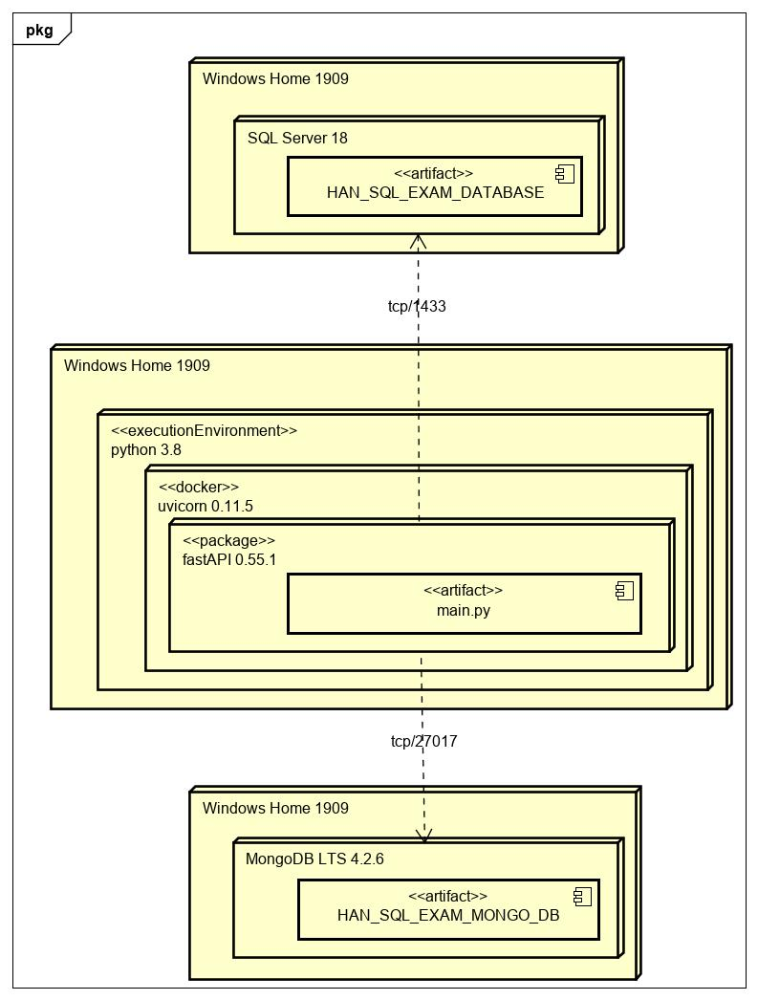
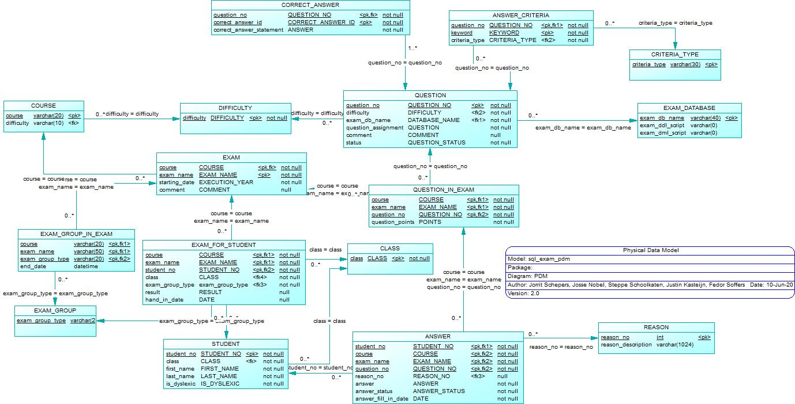
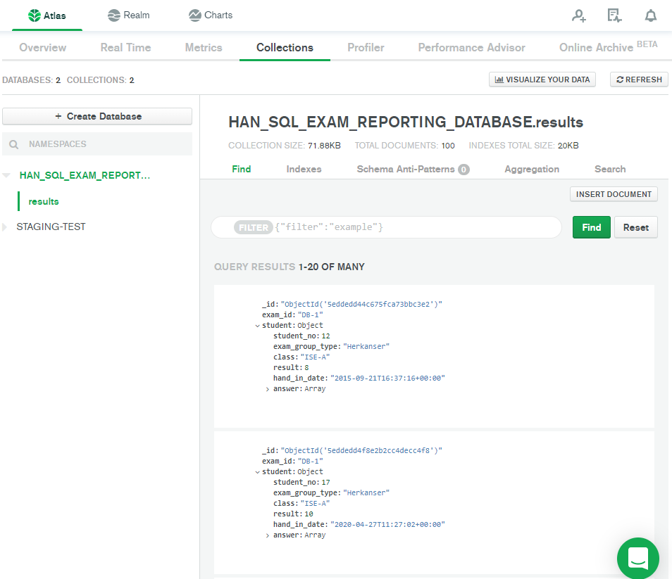
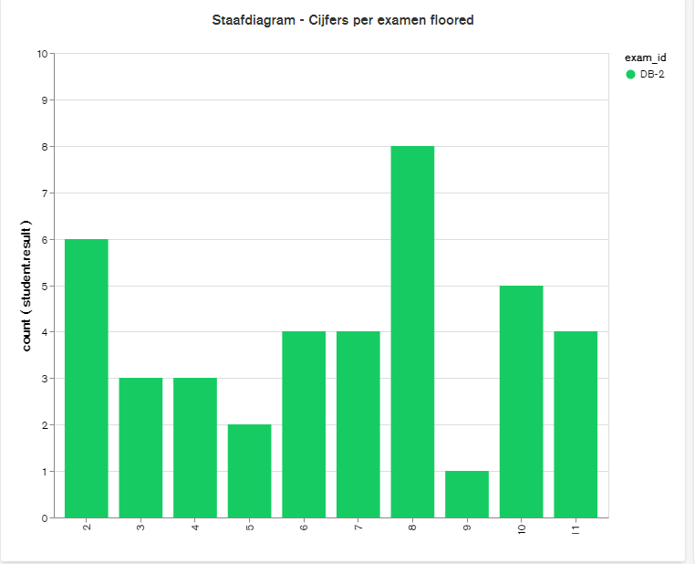
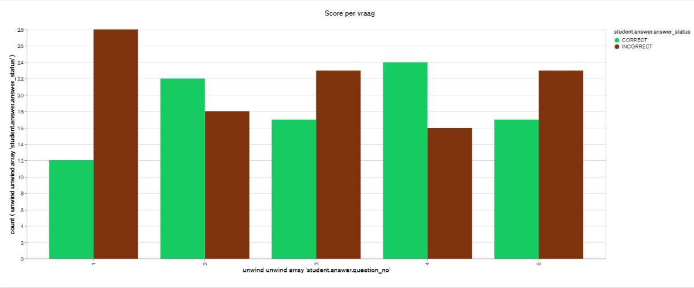

Technisch ontwerp - ISE Projectgroep 4
======================================

Assingment: SQL Exam Database
-----------------------------

| Documentinformatie   |                                                  |
|----------------------|--------------------------------------------------|
| Datum van publicatie |                                                  |
| Organisatie          | Hogeschool van Arnhem en Nijmegen                |
| Afdeling             | AIM                                              |
| Projectgroep         | Groep 4                                          |
| Opleiding            | HBO-ICT                                          |
| Profiel              | Software Development, Data Solutions Development |
| Semester             | ISE                                              |
| Begeleiders          | dhr. M. Engelbart                                |
|                      | dhr. L. Van Den Berge                            |
|                      | dhr M. De Jonge                                  |
|                      | mvr. E. Bouwman                                  |
|                      | dhr. C. Scholten                                 |

Inhoudsopgave
-------------

-   [Inleiding](#Inleiding)

-   [System and software architecture](#System-and-software-architecture)

-   [Physical database schema](#Physical-database-schema)

-   [Physical Data Model](#Physical-Data-Model)

-   [Description of tables and columns](#Description-of-tables-and-columns)

-   [Design choices](#Design-choices)

-   [Intregrity rules](#Intregrity-rules)

-   [API omschrijving](#API-omschrijving)
Inleiding
---------

In dit document zal uiteengezet worden hoe het SQL exam database systeem opgezet gaat worden. Voor een complete omschrijving
van de opdracht, zie het functioneel ontwerp. In dit document zullen alle gemaakte keuzes
worden gedocumenteerd. Daarnaast wordt de implementatie van alle constraints behandeld, evenals de opzet van de database
zelf. Dit document is volledig gebaseerd op resultaten gevonden in het functioneel
ontwerp.

Systeem and software architectuur
--------------------------------
In dit hoofdstuk wordt de globale structuur van het systeem weergegeven, zoals de software structuur en het deployment van het systeem.

### Software Structuur
Alle documentatie en code is in de volgende folder structuur ingedeeld. Per folder is er ook een omschrijving gegeven over welke documenten in de folder te vinden zijn.

    ├───database_scripts: Hier zijn alle bestanden te vinden die gebruikt worden bij de relationele database en de MongoDB database.
    │   ├───functions: Hier zijn alle functies die gebruikt worden in de relationele database te vinden.
    │   ├───setup: Hier zijn de bestanden te vinden die nodig zijn om de relationele database correct op te zetten, evenals de bestanden voor het opzetten van de testomgeving.
    |   |   └───users: Hier zijn de users te vinden die aangemaakt kunnen worden voor de database. 
    │   ├───staging_mongodb: Hier zijn de bestanden te vinden die nodig zijn om de MongoDB database correct op te zetten.
    │   ├───stored_procedures: Hier zijn alle stored procedures die gebruikt worden in de relationele database te vinden.
    │   │   ├───delete: Hier zijn de stored procedures te vinden die data verwijderen.
    │   │   ├───insert: Hier zijn de stored procedures te vinden die data uploaden.
    │   │   ├───overig: Hier zijn overige stored procedures te vinden.
    |   |   |   └───grading_procedures: Hier zijn de stored procedures te vinden die gebruikt worden bij het nakijken de antwoorden.
    │   │   ├───select: Hier zijn de stored procedures te vinden die data opvragen.
    │   │   │   └───reporting_procedures: Hier zijn de stored procedures te vinden die de python api gebruikt om data op te halen.
    │   │   └───update: Hier zijn de stored procedures te vinden die data update.
    │   ├───templates: Hier zijn de templates te vinden die gebruikt worden voor de stored procedures, triggers en tests van de relationele database. 
    |   ├───testing: Hier zijn alle bestanden te vinden om het testen van de database op te zetten en uit te voeren. 
    |   |   ├───integration_tests: Hier zijn de integratie tests te vinden. 
    |   |   ├───procedure_tests: Hier zijn de unittests te vinden die de stored procedures testen.
    |   |   └───trigger_tests: Hier zijn de unittests te vinden die de triggers testen.  
    │   └───triggers: Hier zijn alle triggers die gebruikt worden in de relationele database te vinden.
    ├───doc: In deze folder is alle documentatie te vinden die over het volledige informatie systeem gaan. 
    │   ├───Functional Ontwerp: Hier is het functioneel ontwerp te vinden   inclusief bijlagen. 
    │   │   ├───BPMN-images: Hier zijn de bestanden te vinden die gebruikt zijn om een BPMN model te maken.
    │   │   │   └───BPMN-Collection-Images: Hier zijn de afbeeldingen te vinden van de BPMN modellen
    │   │   ├───CDM: Hier zijn de bestanden te vinden die gebruikt zijn om het Conceptueel Data Model te maken inclusief de afbeelding van het Conceptueel Data Model.
    │   │   └───Use-cases: Hier zijn de bestanden te vinden die gebruikt zijn om het Use Case Model te maken. 
    │   │       └───images: Hier is de afbeelding te vinden van het Use Case Model.
    │   ├───Meetings: Hier zijn alle documenten te vinden omtrent meetings en interviews.
    │   │   ├───Agenda: Hier zijn de agenda's te vinden die zijn gebruikt voor de meetings.
    │   │   ├───iteratie-review: Hier is het demo sql bestand te vinden die is gebruikt om de applicatie te laten zien aan de opdrachtgever tijdens de iteratie reviews.
    |   |   |   ├───Constructie fase 1 review: Hier is de demo te vinden die is uitgevoerd tijdens de iteratie review van de eerste constructie fase.
    |   |   |   └───Constructie fase 2 review: Hier is de demo te vinden die is uitgevoerd tijdens de iteratie review van de tweede constructie fase.
    │   │   ├───Notule-daily-taakverdeling: hier staan de planningen die zijn doorgenomen tijdens de daily meetings van het team.
    │   │   └───Notulen: Hier zijn alle notulten te vinden van gesprekken met Docenten en de opdrachtgever.
    │   │       ├───Chris: Hier zijn de notulen van gesprekken met de processbegeleider: Chris Scholten.
    │   │       ├───Helen: Hier zijn de notulen van gesprekken met de profesional skills begeleider: Helen Visser.
    │   │       ├───Marco: Hier zijn de notulen van gesprekken met de opdrachtgever: Marco Engelbart.
    │   │       ├───pva-assessment: Hier zijn de notulen van het plan van aanpak assessment te vinden.
    │   │       └───TT-assessment: Hier zijn de notulen van het tussentijds assessment te vinden.
    │   ├───Plan van  Aanpak: Hier zijn het plan van aanpak en de definition of done te vinden voor dit project.
    │   └───Technisch Ontwerp: Hier staat het technisch ontwerp inclusief bijlagen.
    │       ├───BPMN-diagrams: Hier zijn bestanden waarmee het BPMN modellen gemaakt zijn en afbeeldingen daarvan te vinden.
    │       ├───Deployment-Diagram: Hier zijn het bestand waarmee het deployment diagram gemaakt is en de afbeeldingen daarvan te vinden.
    │       └───PDM: Hier zijn het bestand waarmee het Physical Data Model gemaakt is en de afbeelding daarvan te vinden.
    ├───MongoDB: Hier is de testdata te vinden die gebruikt is om de grafieken op te zetten. Ook is er een URL naar de grafieken. 
    |   └───screenshots_graphs: Hier zijn de screenshots te vinden van de grafieken in de MongoDB.
    ├───PiStagingAPI: Hier is de API te vinden die gegevens van de relationele database naar de MongoDB database stuurt. 
    │   ├───controller: Hier zijn de controllers van het API te vinden. 
    │   ├───repository: Hier zijn de repositories van het API te vinden.
    │   ├───tests: Hier zijn de tests van het API te vinden.
    │   └───view: Hier zijn de views van het API te vinden.
    └───prototypes: Hier zijn de prototypes te vinden die gemaakt zijn in de elaboration fase.
        ├───Staging_prototype: Hier zijn alle documenten te vinden die gaan over het staging prototype. 
        │   ├───REST: Hier is het project te vinden van de API om data over te zetten van een relationele database naar een MongoDB database.
        │   └───SQL_Staging_prototype: Hier zijn SQL scripts te vinden om het prototype op te zetten om data van een relationele database naar een tweede relationele database 
        |                              over te zetten. 
        └───Verification_prototype: Hier is het prototype te vinden over het nakijken van antwoorden van studenten. 


Deployment Diagram
------------------

Het deployment diagram dient ervoor om de verschillende knooppunten van de artifacts die gebruikt gaan worden in kaart te brengen, en ze aan te tonen aan de hand van een diagram.



Deployment Diagram

>   Fig 1 Deployment Diagram

Het systeem bestaat uit de volgende twee hoofdonderdelen: 
1. De SQL Database 
2. De MongoDB Database 

De SQL-database is de hoofddatabase. Hier staan alle gegevens over examens, vragen, groepen, etc. Deze database wordt gedraaid door SQL Server 18.

Daarnaast is er nog een tweede database, een datawarehousing database. Deze is gerealiseerd in MongoDB LTS-versie 4.2.6 en is verbonden met de hoofddatabase via een staging area dat draait in python. In deze database komen alleen de resultaten van studenten te staan. MongoDB kan hier vervolgens rapporten uit genereren.

### Python restfull API

Het restfull API moet de resultaten van de SQL-server database overzetten naar de Mongo database. Het API is opgebouwd volgens het layer pattern om de toevoeging van extra concepten mogelijk te maken zonder bestaande code al te veel aan te hoeven passen. De layers zijn ook weer opgedeeld in verschillende onderdelen. Voor de controller en view laag is er een bestand aanwezig voor ieder concept (studenten, resultaten, antwoorden en vragen). De repository is opgedeeld in een SQL en Mongo bestand. In de repository layer wordt uit de SQL-server database de data opgehaald en de data naar de Mongo database gestuurd. De controller laag zorgt ervoor dat de juiste data naar de Mongo database wordt verstuurd. Zo controleren de controllers of er geen dubbele data aanwezig is. De view laag wordt gebruikt om de controllers aan te sturen vanuit de Mongo database of door user-input. Het API is niet afhankelijk van de JSON-structuur. Dit komt doordat de JSON wordt gegenereerd door SQL-server met behulp van de ```FOR JSON AUTO``` clause. Dit zorgt ervoor dat er nieuwe resultaten kunnen worden toegevoegd aan SQL-server zijde zonder dat er veranderingen moeten worden gemaakt aan de Python code.

De keuze om het API in combinatie met MongoDB te gebruiken is afkomstig van het onderzoek dat in de elaboratie fase is uitgevoerd. Het prototype API is voor dit onderzoek in Java geschreven. Er is uiteindelijk gekozen om over te stappen op python fastAPI. FastAPI heeft buiten de python packages geen externe services nodig om te werken zoals het Java API. Het Java API maakte gebruik van TomEE+. Ook heeft het ontwikkelen van het API in python minder tijd in beslag genomen.

### SQL nakijk functionaliteit

Het nakijken van de antwoorden die door studenten worden ingevoerd, wordt afgehandeld door een aantal procedures. In deze procedures worden de antwoorden op verschillende manieren nagekeken. Hieronder volgt een beschrijving van elk van deze procedures.
-	`Pr_check_all_answers_for_exam`
Deze procedure begint het nakijk proces voor alle antwoorden binnen een afgeronde toets. De procedure heeft de groep en het examen nodig dat moet worden nagekeken. De parameters worden gebruikt om de bijbehorende vragen en antwoorden te verzamelen. Door het gebruik van een cursor wordt voor elk antwoord daarna de procedure `pr_check_answer` uitgevoerd.
-	`Pr_check_answer`
Dit is de procedure die verantwoordelijk is voor het nakijken van een antwoord. Het nakijken wordt met behulp van een syntax check, sleutelwoord check en het vergelijken van de records gedaan in de volgende stappen:
    1. Om het antwoord succesvol te controleren moet de database aanwezig zijn waarop de select statements worden uitgevoerd. Dit word gecontroleerd door de volgende code: 
    ```SQL
    IF NOT EXISTS (SELECT name FROM master.dbo.sysdatabases WHERE name = @exam_db_name)
        THROW 60101, 'Database required for question is not available', 1;
    ```
    2. Antwoorden die al tussen de correcte antwoorden staan worden direct goedgekeurd. Hierbij worden extra spaties of breaklines niet meegerekent.
    ```SQL
    IF NOT EXISTS (SELECT * FROM CORRECT_ANSWER WHERE question_no = @question_no AND dbo.ft_compare_sql_statements(correct_answer_statement, @answer) = 1)
    ```
    3. Aan vragen kunnen verplichte en niet toegestaande sleutelwoorden gekoppeld zijn.
    4. Antwoorden worden uitgevoerd binnen een try catch blok om te controleren of ze uitvoerbaar zijn. Er wordt gebruik gemaakt van een dynamisch SQL-statement waarbij de database naam wordt ingevoerd zodat het statement op de correcte database wordt uitgevoerd.
    ```SQL
    BEGIN TRY
        DECLARE @statement NVARCHAR(MAX) = @exam_db_name + '.dbo.sp_executesql N''' + REPLACE(@answer, '''', '''''') + ''''
        SELECT @statement
        EXEC (@statement)
    END TRY
    BEGIN CATCH
        THROW 60102, 'Statement not executable', 1;
    END CATCH
    ```
    5. Ten slotte wordt het resultaat van de query vergeleken met het resultaat van het correcte antwoord. Hiervoor wordt gebruik gemaakt van de ```FOR JSON AUTO``` functie van SQL-server. Door de resultaten in JSON-formaat te vergelijken kan het aantal records, de kolommen en de volgorde van de records worden getest. Ook wordt de inhoud van de records op deze manier vergeleken. Voorheen is er gebruik gemaakt van een “EXCEPT, UNION, EXCEPT” constructie. De JSON-vergelijking is hierover gekozen omdat de constructie geen ORDER BY ondersteunt. 
    ```SQL
    DECLARE @json_correct varchar(MAX)
    EXEC @json_correct = ft_execute_statement_into_json @correct_statement, @exam_db_name
    DECLARE @json_attempt varchar(MAX)
    EXEC @json_attempt = ft_execute_statement_into_json @answer, @exam_db_name
    ```

Physical Data Model
-------------------

In dit hoofdstuk wordt het fysieke datamodel weergegeven. Dit model geeft de complete structuur van de hoofd database weer. Het systeem bestaat uit een aantal verschillende kern onderdelen. Allereerst wordt er in deze database de gegevens van studenten opgeslagen, waaronder de klas, naam en studentnummer van de student. Daarnaast worden alle vragen en examens van de course database opgeslagen. In het hoofdstuk [Description of tables and columns](#Description-of-tables-and-columns) worden de verschillende tabellen uitgelegd.



Physical database Model

>   Fig 2 Physical database Model

Description of tables and columns
---------------------------------

In dit hoofdstuk worden alle tabellen van de database weergegeven en uiteengezet:
* [ANSWER](###ANSWER)
* [ANSWER_CRITERIA](###ANSWER_CRITERIA)
* [CLASS](###CLASS)
* [CORRECT_ANSWER](###CORRECT_ANSWER)
* [COURSE](###COURSE)
* [CRITERIA_TYPE](###CRITERIA_TYPE)
* [DIFFICULTY](###DIFFICULTY)
* [EXAM](###EXAM)
* [EXAM_DATABASE](###EXAM_DATABASE)
* [EXAM_FOR_STUDENT](###EXAM_FOR_STUDENT)
* [EXAM_GROUP](###EXAM_GROUP)
* [EXAM_GROUP_IN_EXAM](###EXAM_GROUP_IN_EXAM)
* [QUESTION](###QUESTION)
* [QUESTION_IN_EXAM](###QUESTION_IN_EXAM)
* [REASON](###REASON)
* [STUDENT](###STUDENT)

### ANSWER

| Kolomnaam           | Type          | Relaties                                       | Omschrijving                                                        |
|---------------------|---------------|------------------------------------------------|---------------------------------------------------------------------|
| student_no          | int           | Primary key, foreign key naar STUDENT          | Het studentnummer van de student die het antwoord heeft gegeven     |
| exam_id             | varchar(20)   | Primary key, foreign key naar QUESTION_IN_EXAM | Het examen waarop het antwoord is gegeven                           |
| question_no         | int           | Primary key, foreign key naar QUESTION_IN_EXAM | De vraag waarop het antwoord is gegeven                             |
| reason_no           | int           | Foreign key naar REASON                        | De reden waarom het gegeven antwoord fout is                        |
| answer              | varchar(max)  |                                                | Het antwoord dat door de student is gegeven                         |
| answer_status       | varchar(50)   |                                                | Geeft aan of het antwoord al is nagekeken en/of het goed of fout is |
| answer_fill_in_date | datetime      |                                                | Geeft aan wanneer de vraag is beantwoord                            |

### ANSWER_CRITERIA

| Kolomnaam     | Type        | Relaties                               | Omschrijving                                                  |
|---------------|-------------|----------------------------------------|---------------------------------------------------------------|
| question_no   | int         | Primary key, foreign key naar QUESTION | Het vraagnummer waar de gegeven criteria naar verwijst        |
| keyword       | varchar(30) | Primary key                            | Het woord dat gebruikt wordt voor de criteria                 |
| criteria_type | varchar(30) | Foreign key naar CRITERIA_TYPE         | Het soort criteria dat moet worden toegepast bij het nakijken |

Een answer criteria kan per vraag worden toegevoegd om te kunnen controleren dat een antwoord een bepaald woord wel of niet gebruikt.

### CLASS

| Kolomnaam | Type        | Relaties    | Omschrijving                   |
|-----------|-------------|-------------|--------------------------------|
| class     | varchar(20) | Primary key | Geeft de naam van een klas aan |

### CORRECT_ANSWER

| Kolomnaam      | Type          | Relaties                               | Omschrijving                                                             |
|----------------|---------------|----------------------------------------|--------------------------------------------------------------------------|
| question_no    | int           | Primary key, foreign key naar QUESTION | Het vraagnummer waar het antwoord naar verwijst                          |
| correct_answer | smallint      | Primary key                            | Het antwoord op de gegeven vraag                                         |
| correct_answer | varchar(max)  |                                        | Het antwoord op de gegeven vraag                                         |

### COURSE

| Kolomnaam     | Type        | Relaties                    | Omschrijving                                       |
|---------------|-------------|-----------------------------|----------------------------------------------------|
| course        | varchar(20) | Primary key                 | De naam van een course dat gegeven wordt op de HAN |
| difficulty    | varchar(10) | Foreign key naar DIFFICULTY | De moeilijkheidsgraad van het vak                  |

### CRITERIA_TYPE

| Kolomnaam     | Type        | Relaties    | Omschrijving                                                       |
|---------------|-------------|-------------|--------------------------------------------------------------------|
| criteria_type | varchar(30) | Primary key | Het soort type criteria dat moet worden toegepast bij het nakijken |

### DIFFICULTY

| Kolomnaam  | Type        | Relaties    | Omschrijving                                                             |
|------------|-------------|-------------|--------------------------------------------------------------------------|
| difficulty | varchar(10) | Primary key | Een moeilijkheidsgraad dat wordt toegekend aan een course of examenvraag |

De difficulty tabel geeft een moeilijkheidsgraad dat gebruikt kan worden door leraren om te bepalen welke vragen ze moeten gebruiken voor een examen. De moeilijkheidsgraad is gebaseerd op het leerjaar waarvoor de vraag is gemaakt en hoe moeilijk de vraag is ten opzichte van andere vragen van dat leerjaar.

### EXAM

| Kolomnaam     | Type         | Relaties                | Omschrijving                                                             |
|---------------|--------------|-------------------------|--------------------------------------------------------------------------|
| exam_id       | varchar(20)  | Primary key             | De omschrijving van het examen                                           |
| course        | varchar(20)  | Foreign key naar COURSE | De naam van de course waarvoor dit examen is                             |
| exam_name     | varchar(50)  |                         | De naam van het examen                                                   |
| starting_date | datetime     |                         | De datum en tijd waarop het examen plaatsvindt                           |
| comment       | varchar(max) |                         | Een comment die achtergelaten kan worden over hoe het examen is verlopen |

### EXAM_DATABASE

| Kolomnaam       | Type         | Relaties    | Omschrijving                                                   |
|-----------------|--------------|-------------|----------------------------------------------------------------|
| exam_db_name    | varchar(40)  | Primary key | De naam van een test database dat gebruikt wordt bij een toets |
| exam_ddl_script | varchar(max) |             | Het create script van de database                              |
| exam_dml_script | varchar(max) |             | Het bijbehorende populatiescript                               |

### EXAM_FOR_STUDENT

| Kolomnaam       | Type         | Relaties                              | Omschrijving                                                              |
|-----------------|--------------|---------------------------------------|---------------------------------------------------------------------------|
| exam_id         | varchar(20)  | Primary key, foreign key naar EXAM    | Het examen dat een student mag maken                                      |
| student_no      | int          | Primary key, foreign key naar STUDENT | Het studentnummer van de student dat het examen mag maken                 |
| class           | varchar(20)  | Foreign key naar CLASS                | De klas waarin de student zit op het moment dat hij het examen gaat maken |
| exam_group_type | varchar(20)  | Foreign key naar GROUP                | De groep waarin de student zit voor dit examen                            |
| hand_in_date    | datetime     |                                       | De datum en tijd waarop de student het examen heeft ingeleverd            |
| result          | numeric(4,2) |                                       | Het behaalde resultaat van het examen dat door de student is gemaakt      |

### EXAM_GROUP

| Kolomnaam        | Type        | Relaties    | Omschrijving                |
|------------------|-------------|-------------|-----------------------------|
| exam_group_type  | varchar(20) | Primary key | De naam van een soort groep |

Een groep geeft aan of een student recht heeft op extra tijd of eventuele andere extra rechten.

### EXAM_GROUP_IN_EXAM

| Kolomnaam       | Type        | Relaties                            | Omschrijving                                                      |
|-----------------|-------------|-------------------------------------|-------------------------------------------------------------------|
| exam_id         | varchar(20) | Primary key, foreign key naar EXAM  | Het examen die de groep maakt                                     |
| exam_group_type | varchar(20) | Primary key, foreign key naar GROUP | De groep die het examen gaat maken                                |
| end_date        | datetime    |                                     | De einddatum en tijd waarop de groep aan het examen mag werken    |

Een groep wordt gekoppeld aan een examen. Elke groep heeft een eigen eindtijd zodat bepaalde groepen langer de tijd hebben voor een examen.

### QUESTION

| Kolomnaam           | Type          | Relaties                       | Omschrijving                                               |
|---------------------|---------------|--------------------------------|------------------------------------------------------------|
| question_no         | int           | Primary key                    | De id van een vraag                                        |
| difficulty          | varchar(10)   | Foreign key naar DIFFICULTY    | De moeilijkheidsgraad van een vraag                        |
| exam_db_name        | varchar(40)   | Foreign key naar EXAM_DATABASE | De test database waar de vraag op van toepassing is        |
| question_assignment | varchar(max)  |                                | De vraag die aan de student gesteld gaat worden            |
| comment             | varchar(max)  |                                | Een comment die gelaten kan worden zodat een leraar weet waar die naar moet kijken bij het nakijken van de vraag |
| status              | varchar(20)   |                                | Geeft aan of een vraag gebruikt wordt in een examen of niet |

Aan een vraag moet een moeilijkheidsgraad worden toegekend zodat een leraar een overzicht kan krijgen van vragen voor een bepaalde course. Commentaar kan op de vraag worden gezet zodat een leraar beter weet hoe de vraag nagekeken moet worden.

### QUESTION_IN_EXAM

| Kolomnaam       | Type        | Relaties                               | Omschrijving                                           |
|-----------------|-------------|----------------------------------------|--------------------------------------------------------|
| exam_id         | varchar(20) | Primary key, foreign key naar EXAM     | Het examen waar de vraag wordt gesteld                 |
| question_no     | int         | Primary key, foreign key naar QUESTION | De vraag die in het examen gesteld gaat worden         |
| question_points | smallint    |                                        | Het aantal punten dat een goed antwoord op kan leveren |

### REASON

| Kolomnaam          | Type          | Relaties    | Omschrijving                            |
|--------------------|---------------|-------------|-----------------------------------------|
| reason_no          | int           | Primary key | Geeft de naam van de reden aan          |
| reason_description | varchar(1024) |             | Geeft een omschrijving van de reden aan |

De rede maakt duidelijk waarom een gegeven antwoord is fout gekeurd door het nakijksysteem.

### STUDENT

| Kolomnaam   | Type        | Relaties               | Omschrijving                                       |
|-------------|-------------|------------------------|----------------------------------------------------|
| student_no  | int         | Primary key            | Het studentnummer van een student                  |
| class       | varchar(20) | Foreign key naar CLASS | De klas waarin de student op dit moment zit        |
| first_name  | varchar(30) |                        | De voornaam van een student                        |
| last_name   | varchar(50) |                        | De achternaam van een student                      |
| is_dyslexic | bit         |                        | Geeft aan of de student recht heeft op extra tijd  |

Design choices
--------------

### Reason tabel

De reason tabel is toegevoegd na het maken van de nakijk functie. De stored procedure geeft error codes terug indien een antwoord fout wordt gerekend. Om duidelijk te maken aan de gebruikers waarom een antwoord fout is bevat de reason tabel ook een kolom waar een omschrijving van de error code in staat. 

### CRUD stored procedures

Alle gebruikers kunnen alleen via stored procedures data manipuleren in de database. Dit geeft ons meer controle op welke data kan worden aangepast door gebruikers. Ook kunnen business rules, die niet in het PDM zijn verwerkt, hierin worden geforceerd. Stored procedures hebben ook het voordeel dat deze het implementeren van een toekomstig front-end simpeler maken. Er hoeft dan geen sql behalve het execute statement in het front-end te worden gebruikt. Om alle stored procedures uniform te maken moeten deze het template volgen. Dit template bevat de transaction management en error afhandeling. Door dit te gebruiken is het onderhouden van de stored procedures gemakkelijker. Om het onderhouden nog makkelijker te maken staan alle stored procedures in aparte bestanden evenals de bijbehorende tSQLt tests. Dit maakt het mogelijk om meerdere ontwikkelaars tegelijk aan verschillende stored procedures te laten werken zonder dat er merge conflicts plaatsvinden.

### Gebruik examengroepen

Wanneer een examen wordt gestart zijn er bijna altijd een aantal studenten die extra tijd krijgen voor het examen, daarom is ervoor gekozen om studenten aan een examengroep te linken voor een examen. Deze examengroep heeft altijd dezelfde starttijd die in de tabel EXAM wordt vastgesteld, maar kan een aparte eindtijd hebben, die in de tabel EXAM_GROUP_IN_EXAM wordt vastgesteld. Deze eindtijd moet altijd na de starttijd zijn van een examen.

### Error codes

De error codes die in het systeem voor kunnen komen (buiten de standaard codes van SQL-server) staan gedocumenteerd in een centraal document. Er ik gekozen om deze in een aantal categorieën in te delen. Deze categorieën hebben een unieke code vanaf 60001. In het bereik van een categorie kunnen de error codes worden toegevoegd met beschrijving die bij die categorie horen. Door de categorieën is het snel te zien voor een ontwikkelaar welk soort probleem er aanwezig is. De keuze om vanaf error code 60001 te beginnen is gemaakt omdat Microsoft t/m 50000 heeft gereserveerd voor standaard SQL-server error codes. De extra 10000 is als marge genomen voor eventuele systemen die moeten worden geïntrigeerd. In de tabel hieronder staan alle huidige categorieën die momenteel voor kunnen komen in het systeem.

| Bereik foutmeldingcodes | Omschrijving foutmeldingtype                                                                                                             |
|-------------------------|------------------------------------------------------------------------------------------------------------------------------------------|
| 60001-60050             | Verschijnt wanneer er een invalide waarde wordt gebruikt bij het oproepen van een procedure, zoals bijvoorbeeld een NULL waarde          |
| 60051-60100             | Verschijnt wanneer er een waarde wordt opgegeven die niet in de database staat, zoals een onbekende exam_id of database naam             |
| 60101-60150             | Verschijnt bij het automatisch nakijken van een examen en geeft de rede terug waarom een antwoord op een vraag fout is                   |
| 60151-60200             | Verschijnt wanneer iemand gegevens probeert aan te passen die niet aangepast meer mogen worden omdat het examen al plaats heeft gevonden |
| 60101-60250             | Verschijnt wanneer de examen database niet goed uitgevoerd kan worden                                                                    |

### Gebruik templates
Voor dit systeem is een API opgezet waarbij er voor elke stored procedure, trigger of test een template is opgezet. Door het gebruik van deze template is elk onderdeel van het systeem gestroomlijnd en is het overzichtelijker te lezen dan wanneer elk onderdeel een eigen template zou gebruiken. Een belangrijke template is die van de stored procedure. Voor alle stored procedures (behalve de select-procedures) is transaction handling ingebouwd. De hebben wij gedaan voor wanneer er geneste transactions zijn, deze een foutmelding kunnen teruggeven zonder dat de procedure die het oproept ook hoeft te falen.

De templates die gebruikt zijn voor dit project staan hieronder weergegeven.

#### Stored procedure template
```SQL
USE HAN_SQL_EXAM_DATABASE
GO
CREATE OR ALTER PROCEDURE pr_template
AS
BEGIN
    SET NOCOUNT ON;
    DECLARE @startTC INT = @@TRANCOUNT;
    DECLARE @savepoint VARCHAR(128) = CAST(OBJECT_NAME(@@PROCID) AS VARCHAR(125)) + CAST(@@NESTLEVEL AS VARCHAR(3));
    BEGIN TRY
        BEGIN TRANSACTION
            SAVE TRANSACTION @savepoint;
            -- Logic
        COMMIT TRANSACTION;
    END TRY
    BEGIN CATCH
        IF XACT_STATE() = -1 AND @startTC = 0
            ROLLBACK TRANSACTION;
        ELSE
            IF XACT_STATE() = 1
                BEGIN
                    ROLLBACK TRANSACTION @savepoint;
                    COMMIT TRANSACTION;
                END;
        DECLARE @errormessage VARCHAR(2000) =
                'Error occured in sproc ''' + OBJECT_NAME(@@procid) + '''. Original message: ''' + ERROR_MESSAGE() +
                '''';
        THROW 50000, @errormessage, 1;
    END CATCH;
END
```
#### Trigger template
```sql
CREATE OR ALTER TRIGGER tr_template
    ON dbo.template
    FOR UPDATE, INSERT, DELETE
    AS
BEGIN
    IF @@ROWCOUNT = 0
        RETURN;

    SET NOCOUNT ON;

    BEGIN TRY
        --Logic
    END TRY
    BEGIN CATCH
        ;THROW
    END CATCH
END
GO
```

#### Testing template
```sql
-- Fill every XXX
use HAN_SQL_EXAM_DATABASE
go

exec tSQLt.NewTestClass XXX 
go

create or alter proc XXX.[test if XXX] 
as
begin
    exec tSQLt.FakeTable XXX

    -- CHOOSE ONE
    exec tSQLt.ApplyConstraint XXX
    exec tSQLt.ApplyTrigger XXX

    -- CHOOSE ONE
    EXEC tSQLt.ExpectException @ExpectedMessagePattern = '%question_no cannot be null%', @ExpectedSeverity = 16, @ExpectedState = NULL;
    exec tSQLt.ExpectNoException

    -- EXECUTE FOR PROC
    exec XXX 
end
go
```

### Concurrency
Omdat dit systeem bestaat uit een stored procedure API laag in de database, is het risico voor concurrency enorm verlaagd doordat andere applicaties niet zomaar bewerkingen kunnen uitvoeren op de data. Bijna alle stored procedures hebben hierdoor in termen van concurrency geen problemen doordat ze maar een statement uitvoeren per procedure. De enige procedures waarbij er eventuele concurrency problemen kunnen voorkomen zijn bij de procedures ```pr_check_all_answers``` en ```pr_hand_in_exam```. Bij de procedure ```pr_check_all_answers``` is het probleem minimaal omdat het nakijken van een examen alleen plaatsvindt op een afgeronde examen waarbij er geen aanpassingen meer gemaakt kunnen worden aan vragen en antwoorden. Bij de procedure ```pr_hand_in_exam``` is het theoretisch gezien mogelijk om een antwoord op een vraag te uploaden wanneer dit examen wordt ingeleverd. Het probleem zit hem daarbij in dat deze procedures alle vragen waar geen antwoord op gegeven is, een lege antwoord van maakt, waardoor je op dat moment niet een nieuw antwoord kan toevoegen ervoor. Omdat dit probleem niet voor kan komen wanneer een student het antwoord zelf inlevert en er geen security problemen kunnen optreden is er ook hier voor gekozen om de concurrency zo te laten als het is.

## Intregrity rules

### IR1 komt overeen met C1

-   **Specificatie:** Wanneer een student het antwoord op een vraag leeglaat,
    moet deze vraag als fout worden gerekend.

-   **Implementatie:** Binnen de procedure pr_hand_in_exam zal er als eerste
    worden gekeken of er überhaupt een antwoord is gegeven.

-   **Rede:** Het kan voorkomen dat het juiste antwoord een lege result set
    teruggeeft. Als een antwoord leegt blijft dan compileerd deze, en geeft deze
    niks terug. Om te voorkomen dat dit ervoor zorgt dat lege antwoorden goed
    worden gekeurd moet er eerst gechecked worden of er uberhaubt een antwoordt
    gegeven is.

### IR2 komt overeen met C2

-   **Specificatie:** Wanneer een student een antwoord geeft dat de juiste
    syntax en resultaten geeft, maar niet in de lijst met goedgekeurde
    antwoorden staat, moet een leraar dit antwoord goedkeuren voordat het wordt
    toegevoegd aan de lijst met goede antwoorden.

-   **Implementatie:** via de procedure pr_select_pending_correct_answers_for_exam krijgt een leraar alle
    door het systeem goedgekeurde antwoorden te zien en kan deze ze als echt
    correct beoordelen. Via de procedure pr_set_pending_correct_answer_to_false of de procedure pr_set_pending_correct_answer_to_true wordt het antwoord vervolgens
    wel of niet toegevoegd aan de lijst met correcte antwoorden.

-   **Rede:** In SQL zijn er veel verschillende manieren om informatie-behoefte
    op te lossen. Soms kan het zijn dat implementaties dezelfde result set
    teruggeven, maar dat deze toch anders zijn. Dit kan moeilijk worden
    gecontroleerd door dit systeem. Voor deze reden zal deze vraag moeten worden
    bekeken door een professional.

### IR3 komt overeen met C3

-   **Specificatie:** Wanneer een antwoord van een student onjuiste syntax
    heeft, moet dit antwoord automatisch fout gerekend worden.

-   **Implementatie:** Binnen de procedure pr_check_answer zal er moeten worden
    gecontroleerd of het statement compileert. Als dit niet het geval is wordt er een rede teruggegeven die in de table ANSWER wordt gezet
    om duidelijk te maken waarom het antwoord fout is.

-   **Rede:** Om leraren tijd te besparen worden antwoorden die onjuist zijn qua
    syntax gelijk fout gerekend.

### IR4 komt overeen met C4

-   **Specificatie:** Wanneer de resultaten van een student zijn berekend,
    moeten deze resultaten worden doorgegeven naar een externe database.

-   **Implementatie:** Door een API gemaakt in python zal er data worden
    verzonden van de hoofddatabase naar de datawarehouse. Deze API zal gebruik maken van de stored procedure pr_select_results_into_json om alle benodigde data op te halen.

-   **Rede:** MongoDB beschikt over een betere manier van het genereren van
    grafieken. Daarnaast zorgt dit ervoor dat de hoofddatabase geen ruimte of tijd hoeft te besteden aan het generen van deze grafieken wat de prestaties van het systeem verbeterd.

### IR5 komt overeen met C5

-   **Specificatie:** Als een antwoord is ingestuurd door een student, moet een
    leraar deze kunnen inzien.

-   **Implementatie:** Er zijn een aantal procedures, pr_select_all_answers_for_exam, pr_select_answers_for_exam_per_student die alle
    vragen en antwoorden ophaalt die nog ingezien moeten worden.

-   **Rede:** Om alles overzichtelijk te houden en ervoor te zorgen dat er geen
    toetsen kwijtraken en/of resultaten onbekend blijven.

### IR6 komt overeen met C6

-   **Specificatie:** Als de tijd van de toets is verstreken mag de student zijn
    antwoorden niet meer wijzigen of opsturen.

-   **Implementatie:** via een trigger tr_check_if_given_answer_is_within_time
    wordt er gecontroleerd of een opgestuurde antwoord binnen de tijd is van het
    examen.

-   **Rede:** Voor toetsen krijg je altijd en opgelegde duur. Regeling stelt dat
    je na deze tijd geen antwoorden meer mag geven.

### IR7 komt overeen met C7

-   **Specificatie:** Toetsen mogen maximaal 1 keer open gezet worden.

-   **Implementatie:** via een trigger tr_check_for_exam_time wordt er
    gecontroleerd of het examen al gestart is of niet.

-   **Rede:** Wanneer een toets aangemaakt wordt mag deze niet meer worden
    aangepast of opnieuw worden opengezet wanneer de toets al begonnen is.

## API omschrijving

Voor dit systeem is er een API gebouwd in de database laag. In dit hoofdstuk wordt deze API beschreven door voor elke stored procedure een korte omschrijving te geven en op welke use case vanuit het functioneel ontwerp deze van toepassing is.

### Insert procedures
| Naam procedure                              | Omschrijving gebruik procedure                                        | Use case waarop de procedure van toepassing is |
|---------------------------------------------|-----------------------------------------------------------------------|------------------------------------------------|
| pr_add_student_to_exam                      | Voegt een student toe aan een examen                                  | Examen beheren                                 |
| pr_connect_question_to_exam                 | Voegt een vraag toe aan een examen                                    | Examen beheren                                 |
| pr_insert_all_students_from_a_class_in_exam | Voegt een klas toe aan een examen                                     | Examen beheren                                 |
| pr_insert_answer                            | Voegt een antwoord van een student toe op een vraag                   | Vraag beantwoorden                             |
| pr_insert_answer_criteria                   | Voegt een criteria voor een antwoord op een vraag toe                 | Vragenset met antwoorden beheren               |
| pr_insert_class                             | Voegt een nieuwe klas toe                                             | Studenten beheren                              |
| pr_insert_correct_answer                    | Voegt een correcte antwoord op een vraag toe                          | Vragenset met antwoorden beheren               |
| pr_insert_exam                              | Voegt een nieuwe examen toe                                           | Examen beheren                                 |
| pr_insert_exam_database                     | Voegt een nieuwe database toe dat gebruikt kan worden voor een examen | Vragenset met antwoorden beheren               |
| pr_insert_exam_group_in_exam                | Koppelt een examengroep aan een examen                                | Examen beheren                                 |
| pr_insert_question                          | Voegt een nieuwe vraag en correcte antoord toe aan een examen         | Examen beheren                                 |
| pr_insert_stand_alone_question              | Voegt een nieuwe vraag en correcte antwoord toe                       | Vragenset met antwoorden beheren               |
| pr_insert_student                           | Voegt een nieuwe student toe                                          | Studenten beheren                              |
| pr_insert_student_to_exam                   | Voegt een student toe aan een examen en examengroep                   | Examen beheren                                 |


### Select procedures
| Naam procedure | Omschrijving gebruik procedure | Use case waarop de procedure van toepassing is |
|----------------|--------------------------------|------------------------------------------------|
| pr_select_all_answers_for_exam               | Selecteert alle gegeven antwoorden voor een examen                              | Antwoorden                                 | 
| pr_select_all_question_assignments_from_exam | Selecteert alle vragen voor een examen                                          | Vraag beantwoorden                         |
| pr_select_answers_for_exam_per_student       | Geeft alle gegeven antwoorden voor een examen van een student terug             | Antwoorden inzien                          |
| pr_select_correct_answers_from_quesiton      | Selecteert alle correcte antwoorden op een vraag| Antwoorden inzien             |                                            |
| pr_select_pending_correct_answers_for_exam   | Selecteert alle gegeven antwoorden die nog nagekeken moeten worden              | Antwoorden inzien                          |
| pr_select_results_for_student_answer         | Selecteert het behaalde resultaat dat een student voor een examen heeft gehaald | Overzicht bekijken van behaalde resultaten |
| pr_select_students_from_class                | Selecteert alle studenten uit een klas                                          | Student beheren                            |
| pr_select_student_from_group                 | Selecteert alle studente uit een bepaalde examengroep                           | Student beheren                            |

### Select procedures voor staging area
| Naam procedure              | Omschrijving gebruik procedure                      | Use case waarop de procedure van toepassing is    |
|-----------------------------|-----------------------------------------------------|---------------------------------------------------|
| pr_select_results_into_json | Selecteert alle benodigde data voor de staging area | Overzicht bekijken van behaalde resultaten        |

Deze procedure haalt de volgende gegevens op om door te sturen naar de data warehouse:
- exam_id
- student_no
- student.exam_group_type
- student.class
- student.result
- student.hand_in_date
- aswer.answer_status
- answer.answer_fill_in_date
- answer.question_no

Deze data wordt vervolgens in de data warehouse gebruikt om grafieken te genereren voor de docenten.

### Update procedures
| Naam procedure               | Omschrijving gebruik procedure                                   | Use case waarop de procedure van toepassing is |
|------------------------------|------------------------------------------------------------------|------------------------------------------------|
| pr_update_answer             | Bewerkt een al gegeven antwoord op een vraag                     | Vraag beantwoorden                             |
| pr_update_answer_criteria    | Bewerkt een antwoord criteria op een vraag                       | Vragenset met antwoorden beheren               |
| pr_update_class              | Bewerkt de naam van een klas                                     | Student beheren                                |
| pr_update_correct_answer     | Bewerkt een correcte antwoord op een vraag                       | Vragenset met antwoorden beheren               |
| pr_update_ddl                | Bewerkt een ddl_script voor een examen database                  | DDL & DML beheren                              |
| pr_update_dml                | Bewerkt een dml_script voor een examen database                  | DDL & DML beheren                              |
| pr_update_exam               | Bewerkt de gegevens van een examen                               | Examen beheren                                 |
| pr_update_exam_databas       | Bewerkt de gegevens van een examen database                      | DDL & DML beheren                              |
| pr_update_exam_for_student   | Bewerkt de gegevens voor de student die deelneemt aan een examen | Student beheren                                |
| pr_update_exam_group         | Bewerkt een groep type                                           | Examen beheren                                 |
| pr_update_exam_group_in_exam | Bewerkt de examengroep die aan een examen gekoppeld is           | Examen beheren                                 |
| pr_update_question           | Bewerkt een vraag                                                | Vragenset met antwoorden beheren               |
| pr_update_student            | Bewerkt de gegevens van eens student                             | Student beheren                                |

### Delete procedures
| Naam procedure           | Omschrijving gebruik procedure          | Use case waarop de procedure van toepassing is    |
|--------------------------|-----------------------------------------|---------------------------------------------------|
| pr_delete_answer_criteria| Verwijderd een antwoord criteria op een vraag| Vragenset met antwoorden beheren             |
| pr_delete_correct_answer | Verwijderd een correcte antwoord op een vraag| Vragenset met antwoorden beheren             |
| pr_delete_exam           | Verwijderd een examen dat nog niet heeft plaatsgevonden | Examen beheren                    |
| pr_delete question       | Zet de status van een vraag op verwijderd | Vragenset met antwoorden beheren                |
| pr_disconnect_question_from_exam | Verwijderd een vraag uit een examen | Examen beheren                                |
| pr_remove_student_from_exam | Verwijderd een student uit een examen| Examen beheren                                    |

### Grading procedures
| Naam procedure                               | Omschrijving gebruik procedure                                          | Use case waarop de procedure van toepassing is |
|----------------------------------------------|-------------------------------------------------------------------------|------------------------------------------------|
| pr_check_answer                              | Kijkt of een antwoord overeen komt een een correcte antwoord            | -                                              |
| pr_check_all_answer                          | Kijkt een complete examen na en retourneert of vragen goed of fout zijn | -                                              |
| pr_manipulate_population_of_current_database | Manipuleerd zijn eigendatabase                                          | -                                              |
| pr_manipulate_population_of_other_database   | Roept pr_manipulate_population_of_current_database aan vanuit de HAN_SQL_EXAM_DATABASE database | -                      |
| pr_calculate_results_for_exam				   | Berekent de resultaten van studenten uit voor een examen				 | -                      						  |


### Overige procedures
| Naam procedure                         | Omschrijving gebruik procedure                                       | Use case waarop de procedure van toepassing is |
|----------------------------------------|----------------------------------------------------------------------|------------------------------------------------|
| pr_create_database                     | Start een examen database op voor een examen                         | Vragen beantwoorden                            |
| pr_drop_database                       | Verwijdert een examen database nadat het examen heeft plaatsgevonden | -                                              |
| pr_drop_exam_database_population       | Verwijdert de populatie uit een examen database                      | Vragen beantwoorden                            |
| pr_execute_ddl                         | Voert het ddl_script uit voor een examen                             | -                                              |
| pr_execute_dml                         | Voert het dml_script uit voor een examen                             | -                                              |
| pr_hand_in_exam                        | Levert een gemaakte examen in                                        | Vragen beantwoorden                            |
| pr_set_pending_correct_answer_to_false | Verklaart een gegeven antwoord als fout                              | Antwoorden inzien                              |
| pr_set_pending_correct_answert_to_true | Verklaart een gegeven antwoord als correct                           | Antwoorden inzien                              |

### Triggers
| Naam procedure          | Omschrijving gebruik procedure          | Use case waarop de procedure van toepassing is    |
|-------------------------|-----------------------------------------|---------------------------------------------------|
| tr_ddl_and_dml_filter    | Controleert of het dml en/of ddl script bepaalde niet toegestane statements bevat| DDL & DML script uploaden |
| tr_end_date_is_after_starting_date| Controleert of de gekozen einddatum voor een examen na de startdatum is| Examen beheren |
| tr_fill_in_date_of_answer_between_starting_and_end_date | Controleert of een antwoord in de tijd dat het examen open staat is ingevoerd| Vragen beantwoorden|
| tr_restrict_update_end_time_after_exam_has_been_taken | Zorgt ervoor dat een examen niet mag worden aangepast als deze al heeft plaatsgevonden | Examen beheren |
| tr_set_question_to_pending | Zet een vraag op pending als deze is toegevoegd | Vragen beantwoorden |

API Omschrijving
----------------

Voor de API hebben we gebruik gemaakt van Stored Procedures, maar om de Stored Procedures vollediger te maken en goed te documenteren hebben we dit opgedeeld in meerdere onderdelen.

De complete API bestaat uit:
- Stored Procedures API
- Stored Procedures Code
- Foutmeldingen Handleiding
- Unit Tests
- Belangrijke Processen in de API
- Use Case koppeling met de code
- Staging

## Stored Procedures API

Voor elke Stored Procedure is er beschreven:
- Wat de naam van de procedure is
- Wat deze procedure doet 
- Op welke tabellen uit het CDM de procedure van invloed is
- Hoe de procedure gebruikt moet worden
- Welke foutmeldingen de procedure terug kan geven

Een voorbeeld hiervan uit de Stored Procedures API is:
> ***pr_connect_question_to_exam***

> **Functie**: Laat een gebruiker een vraag toevoegen aan een bestaand examen.

> **Gebruik Procedure**
```sql
EXECUTE pr_connect_question_to_exam 
    @exam_id = 'examId', 
    @question_no = 1, 
    @question_points = 20
```
> **Parameters**
> - @exam_id (VARCHAR(20)): het examen waar de vraag aan toegevoegd moet worden
> - @question_no (INT): de vraag die toegevoegd moet worden aan het examen
> - @question_points (SMALLINT): het aantal punten dat een goed antwoord kan opleveren
> Relaties met tables: EXAM, QUESTION, EXAM_GROUP_IN_EXAM, QUESTION_IN_EXAM

> **Foutmeldingen**
> - 60002: ‘question_no cannot be null’
> - 60001: ’exam_id cannot be null’
> - 60006, 'question_points cannot be null or 0'
> - 60155: ‘questions may not be added to an exam that has taken place’


## Stored Procedures Code

De Stored Procedures zijn in SQL Server geschreven en in mappen gesorteerd op functie, zo zijn er de volgende mappen voor:
- delete
- update
- insert 
- overig
- select
- tests


> Voorbeeld van de uitwerking van ***pr_connect_question_to_exam***
```sql

CREATE OR ALTER PROCEDURE pr_connect_question_to_exam
    @question_no INT,
    @exam_id VARCHAR(20),
    @question_points SMALLINT
AS
BEGIN
    SET NOCOUNT ON;
    DECLARE @startTC INT = @@TRANCOUNT;
    DECLARE @savepoint VARCHAR(128) = CAST(OBJECT_NAME(@@PROCID) AS VARCHAR(125)) + CAST(@@NESTLEVEL AS VARCHAR(3));
    BEGIN TRY
        BEGIN TRANSACTION
            SAVE TRANSACTION @savepoint;
			IF(@question_no IS NULL)THROW 60002, 'question_no cannot be null', 1;
			IF(@exam_id IS NULL)THROW 60001, 'exam_id cannot be null', 1;
			IF(@question_points IS NULL OR @question_points < 1)THROW 60006, 'question_points cannot be null or 0', 1;

			IF(
                EXISTS(
                    SELECT exam_id 
                    FROM EXAM_GROUP_IN_EXAM 
                    WHERE exam_id = @exam_id AND begin_date < GETDATE()
                )
            )
			THROW 60155, 'questions may not be added to an exam that has taken place', 1;

			INSERT INTO QUESTION_IN_EXAM 
            VALUES(@exam_id, @question_no, @question_points)


        COMMIT TRANSACTION;
    END TRY
    BEGIN CATCH
        IF XACT_STATE() = -1 AND @startTC = 0
            ROLLBACK TRANSACTION;
        ELSE
            IF XACT_STATE() = 1
                BEGIN
                    ROLLBACK TRANSACTION @savepoint;
                    COMMIT TRANSACTION;
                END;
        DECLARE @errormessage VARCHAR(2000) =
                'Error occured in sproc ''' + OBJECT_NAME(@@procid) + '''. Original message: ''' + ERROR_MESSAGE() +
                '''';
        THROW 50000, @errormessage, 1;
    END CATCH;
END
```


## Foutmeldingen Handleiding

De foutmeldingen die kunnen voorkomen en die we afvangen in de Store Procedures zijn allemaal opgenomen in de Foutmeldingen Handleiding onder verschillende categoriën beginnend vanaf nummer 60000, om zo een duidelijk overzicht te hebben van alle foutmeldingen. Het startgetal 60000 is gekozen om zo ook te zorgen dat onze foutmeldingen duidelijk te onderscheiden zijn van de andere SQL foutmeldingen.

De categoriën zijn:
- Categorie 60001 t/m 60050: invalid values
- Categorie 60051 t/m 60100: unknown value
- Categorie 60101 t/m 60150: SQL verification
- Categorie 60151 t/m 60200: disallowed modification

Zo staan de foutmeldingen uit de ***pr_connect_question_to_exam***, 60005 & 60155, er onder verschillende categoriën in:

> Categorie 60001 t/m 60050: not null:
Elk van de volgende foutmeldingen verschijnt wanneer er een invalide NULL-waarde
wordt meegegeven als parameter van een stored procedure. Om dit op te lossen
moet deze waarde worden veranderd naar het juiste type, die beschreven staat bij
elke foutmelding.

> Categorie 60151 t/m 60200: disallowed modification:
De foutmeldingen in deze categorie verschijnen wanneer een modificatie aan
bestaande waardes worden gedaan waar dat niet is toegestaan.

| Error code | Message | Problem | Solution |
|------------|---------|---------|----------|
| 60005      | ‘question_assignment cannot be null’ | An invalid null value has been provided where it is not allowed  | Provide a VARCHAR(MAX) value |
| 60155      | ‘Questions may not be added to an exam that has taken place’ | An exam is failing to be modified | A question may not be added to an exam that has taken place or is taking place, create a new exam |


## Unit Tests

Om de integriteit en kwaliteit van de Stored Procedures te waarborgen hebben we voor elke Stored Procedure ook unit tests geschreven. 

> Een voorbeeld van een unit test, voor ***pr_connect_question_to_exam***, om te testen dat er geen *NULL* ingevoerd kan worden voor een *question_no*.

```sql
CREATE OR ALTER PROCEDURE test_pr_connect_question_to_exam.[test if connect_question_to_exam throws question_no cannot be NULL] 
AS
BEGIN
	
	EXECUTE tSQLt.ExpectException @ExpectedMessagePattern = '%question_no cannot be null%', @ExpectedSeverity = 16, @ExpectedState = NULL;

	EXECUTE  pr_connect_question_to_exam @question_no = NULL, @exam_id = 'exam_id', @question_points = 1

END
GO
```


## Belangrijke Processen in de API

In de hele code zijn processen die belangrijker zijn voor de opdracht dan andere processen. Enkele van deze essentiële processen zijn:

- 'Toets Maken' Proces


### Toets Maken

- Leraar plant toets in
    - Begin en eindtijd wordt geset voor ingeschreven **EXAM_GROUPS**
    - Docent maakt vragen
    - Docent kiest vragen

- Aanvang toetsmoment
    - De databases die nodig zijn voor het beantwoorden van de vragen uit **TOETS** worden aangemaakt
    - De DDL en DML worden op de databases uitgevoerd
    - ***START TOETS***

- Tijdens de TOETS
    - Studenten kunnen de opdrachten opvragen
    - Studenten kunnen vervolgens de antwoorden PER vraag uploaden
    - Na het uploaden van de antwoorden worden de geselecteerde kolommen(de resultaten van de geuploade query) naar de student teruggestuurd

- EINDTIJD TOETS Bereikt
    - Studenten kunnen geen vragen meer opvragen en beantwoorden
    - Alle geuploade antwoorden worden door het systeem nagekeken
    - De reden waarom een geupload antwoord fout is, wordt opgeslagen

> Activity Diagram

 
> BPMN Diagram
 


## Use Case koppeling met de code
> N.B. <br/>
Op het moment van schrijven zijn nog niet alle use cases geïmplementeerd.
Dit zijn de volgende use cases:
> - Student moet kunnen inloggen

#### Student moet vragen kunnen beantwoorden
- pr_insert_answer
- pr_update_answer
- pr_hand_in_exam

#### Een Leraar moet een DDL en DML script kunnen uploaden.
- pr_insert_exam_database
- pr_update_exam_database

#### Een Leraar moet een set vragen met bijbehorende antwoorden kunnen uploaden.
- pr_insert_question
- pr_insert_answer_criteria
- pr_connect_question_to_exam

- pr_update_question
- pr_update_answer_criteria

- pr_delete_question
- pr_delete_answer_criteria
- pr_delete_answer
- pr_disconnect_question_from_examen

#### Een leraar moet een gegeven antwoord van een student kunnen toevoegen aan de lijst met correcte antwoorden
- pr_insert_correct_answer
- pr_update_correct_answer
- pr_delete_correct_answer

#### Een Leraar moet de antwoorden van de student kunnen inzien
- pr_select_all_answers_for_exam
- pr_select_answers_for_exam_per_student
- pr_select_results_for_student_answer

#### Alleen Leraren mogen van alle studenten de behaalde resultaten zien
- door in de database gebruik te maken van Users, is het mogelijk dat alleen leraren resultaten van studenten kunnen zien. Verder kunnen overzichten met Staging bekeken worden en daar kunnen authorisaties toegevoegd worden.

> Use Case Diagram:


## Staging
Om niet iedereen zomaar toegang te geven tot de data van de door de studenten gemaakte toetsen, de toetsvragen en resultaten, maar docenten wel een inzicht te geven
van hoe de toetsen gemaakt zijn per klas, groep en per vraag door middel van grafieken, is ervoor gekozen om gebruik te maken van een staging database.

Op deze staging database wordt alleen data opgeslagen waar vervolgens grafieken mee gemaakt kan worden.
Zo kan de leraar via deze grafieken makkelijker inzicht krijgen in hoe de toetsen door de studenten zijn gemaakt. Ook is er zo een beter overzicht welke vragen vaak niet goed gemaakt worden. 

Om gebruik te maken van de staging database hebben we er eerst voor gekozen een prototype met RESTFUL API toe te voegen.
Deze RESTFUL API vraagt data op bij de relationele database en stuurt dit in JSON door naar de staging database.

Later is er besloten om toch gebruik te maken van Python API, omdat hierdoor geen installatie van TomEE nodig was, de documentstructuur voor de JSON bestanden sneller aangepast kon worden en Python more easy executable is.

Voor de staging database hebben we gekozen om gebruik te maken van MongoDB. Dit is een document georiënteerde database.
Wij vonden het niet nodig om gebruik te maken van een relationele database voor het staging gedeelte omdat dat overbodig veel moeite zou zijn voor het genereren van grafieken.

Met MongoDB en MongoDB Charts kan er namelijk snel een grafiek gemaakt worden, daarnaast is het makkelijker om JSON objecten te maken met een RESTFUL API omdat we deze kennis al hebben opgedaan in de course DEA.

Hieronder zijn enkele voorbeelden te zien van het Staging onderdeel, zowel hoe de geuploade JSON documenten eruit zien als enkele gemaakte grafieken. Voor een gedetaillerder overzicht kan de staging site ook live bezocht worden via: https://charts.mongodb.com/charts-project-0-bjbuh/public/dashboards/1d0e5a3d-fdc0-4844-b9f9-bb6aeb72e22e :

> JSON Doc's:


```json
{"_id":"ObjectId('5eddedd44c675fca73bbc3e2')",
"exam_id":"DB-1",
"student":
{"student_no":{"$numberInt":"12"},
"exam_group_type":"Herkanser",
"class":"ISE-A",
"result":{"$numberInt":"8"},
"hand_in_date":"2015-09-21T16:37:16+00:00",

"answer":[
    {"answer_status":"INCORRECT",
    "answer_fill_in_date":"2017-03-31T18:02:48+00:00",
    "question_no":{"$numberInt":"1"}},
    {"answer_status":"CORRECT",
    "answer_fill_in_date":"2014-05-19T14:16:08+00:00"
    ,"question_no":{"$numberInt":"2"}},
    {"answer_status":"CORRECT",
    "answer_fill_in_date":"2015-03-21T01:38:17+00:00",
    "question_no":{"$numberInt":"3"}},
    {"answer_status":"CORRECT",
    "answer_fill_in_date":"2019-09-02T19:11:14+00:00",
    "question_no":{"$numberInt":"4"}},
    {"answer_status":"CORRECT",
    "answer_fill_in_date":"2020-01-07T17:59:32+00:00",
    "question_no":{"$numberInt":"5"}}]}}
```

<iframe style="background: #21313C;border: none;border-radius: 2px;box-shadow: 0 2px 10px 0 rgba(70, 76, 79, .2);" width="640" height="480" src="https://charts.mongodb.com/charts-project-0-bjbuh/embed/charts?id=4cc4f213-c062-420e-a697-0e8888e70e69&theme=dark"></iframe>

> Cijfers per examen:


> Score per vraag:
